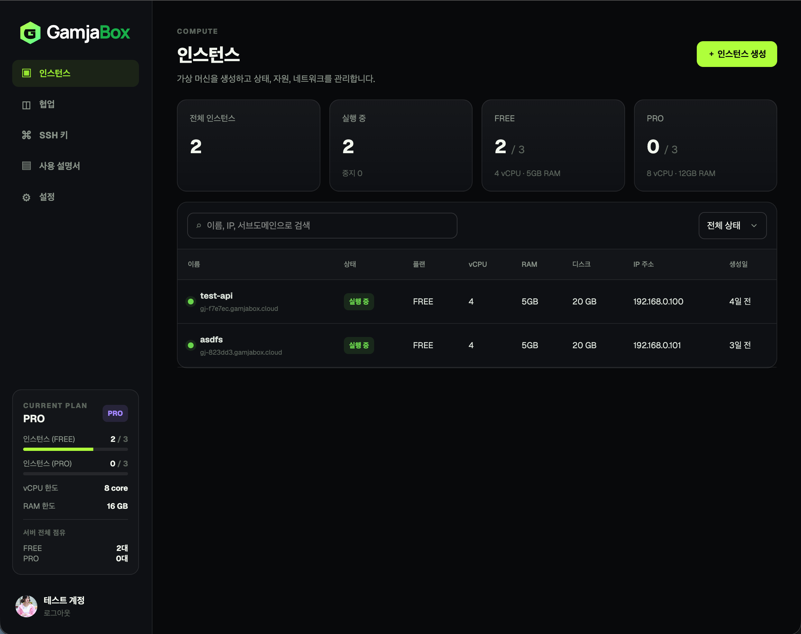
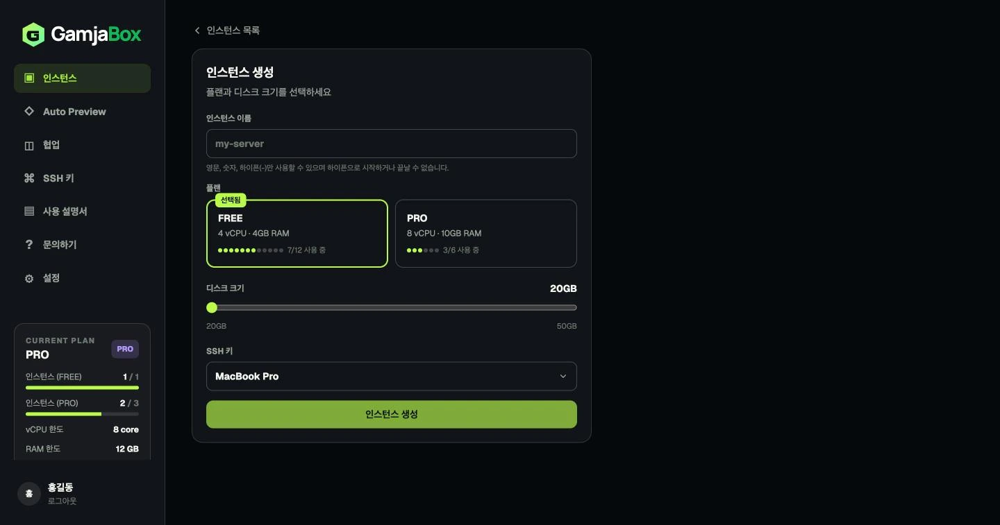
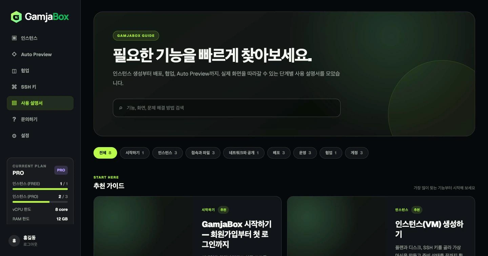
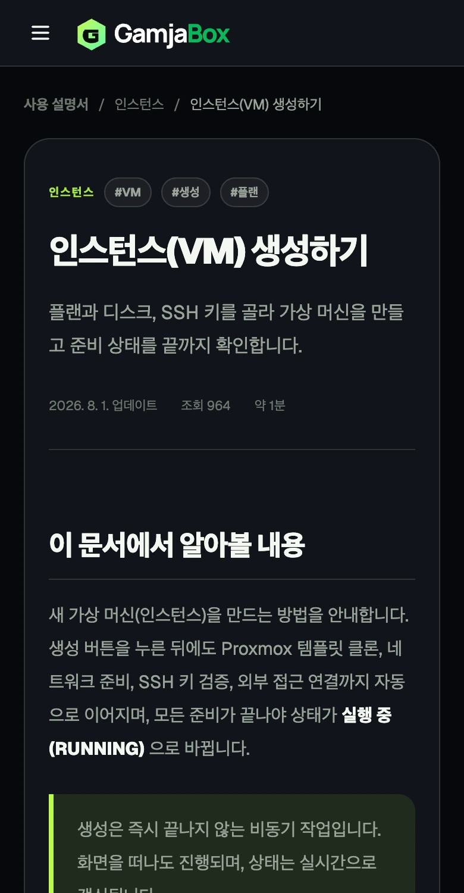

<p align="center">
  
</p>

<p align="center">
  
  개인 Proxmox 서버 위에 구축한 셀프호스팅 IaaS 서비스.<br>
  VM 생성부터 SSH 접속, 포트 노출, 배포, 팀 협업까지 — AWS EC2 + 간이 PaaS를 직접 만든 인프라 위에서.
</p>

<p align="center"><b>라이브 서비스</b> → <a href="https://gamjabox.cloud">gamjabox.cloud</a></p>

---

## 왜 만들었나

AWS EC2 같은 VM 생성 경험을 개인 서버 환경에서도 구현해보고 싶었다. 단순히 VM을 띄우는 것에 그치지 않고, 접속 도메인 발급·접근 제어·포트 노출까지 매번 수동으로 반복하던 인프라 작업을 자동화하는 것이 목표였다. VM 하나를 생성하면 SSH 접속용 서브도메인, Zero Trust 접근 정책, Cloudflare Tunnel ingress 설정이 모두 자동으로 만들어진다.

이후 "VM을 만든 다음, 그 안에서 뭘 할지"까지 서비스 범위를 넓혔다 — 웹 터미널, 파일 브라우저, Git 저장소 기반 배포, AI 보조 배포 스펙 생성까지 붙여서, VM 하나로 코드 저장소를 열고 바로 서비스를 올릴 수 있는 수준까지 만드는 게 지금의 목표다.

서비스를 Auth · User · VM · Ops 네 개로 나눈 건 변경 주기와 신뢰 경계가 다르기 때문이다. 인증 로직(토큰 발급·갱신·탈취 감지), 사용자/플랜 관리, Proxmox·Cloudflare 연동, VM 내부 작업(SSH 세션·배포·백업)은 각각 독립적으로 배포·확장돼야 하고, 실제로 VM 서비스만 WebFlux + R2DBC 기반 비동기 구조로 구현하는 등 기술적 선택도 서비스마다 다르다.

---

## 주요 기능

| 기능 | 설명 |
|---|---|
| **VM 프로비저닝** | Proxmox 템플릿 클론 → cloud-init DHCP 주소 할당 → SSH/cloud-init 준비 검증 → Cloudflare 연동까지 자동화. SSE로 생성 상태 실시간 수신 |
| **SSH 접속** | VM마다 전용 서브도메인 자동 발급. 관리 키로 접속 준비 상태와 사용자 `authorized_keys`를 검증·복구하고, Cloudflare Zero Trust로 이메일 기반 접근 제어 |
| **포트 노출** | HTTP/TCP 포트를 Cloudflare Tunnel로 외부 노출. PUBLIC / PRIVATE 구분, PRO 플랜의 자동 ID 없는 커스텀 CNAME 지원 |
| **플랜 관리** | FREE / PRO 플랜 전환, 디스크 온라인 확장. 플랜 변경은 관리자 승인 후 반영 |
| **계정 보안** | RS256 세션과 Refresh Token Rotation, 이메일 인증·비밀번호 재설정 메일, 점진적 로그인 제한, 현재 비밀번호 재확인 기반 회원 탈퇴 |
| **협업 (Organization)** | 팀 단위로 VM 공유. 메모·공지·요청 게시판, 역할별 권한(OWNER / ADMIN / MEMBER) |
| **사용 설명서 (Docs)** | 사용자 포털에서 기능별 가이드를 검색·카테고리별로 탐색. ControlBox에서 Markdown/GFM 문서, 이미지, 태그, 추천 노출과 발행 상태 관리 |
| **사용자 문의** | 포털에서 기술·계정·플랜·설명서 문의를 접수하고 답변 이력을 확인. 설명서 문맥을 함께 전달하며 ControlBox에서 답변·종료·재오픈 처리 |
| **실시간 메트릭** | CPU·메모리·네트워크·디스크 사용량을 Proxmox API로 수집, SSE 스트림으로 라이브 시각화 |
| **웹 SSH 콘솔** | 브라우저에서 바로 VM 터미널 접속(WebSocket + xterm.js). 로그인 세션과 분리된 일회용 티켓으로 인증 |
| **파일 브라우저** | VM 내부 파일 조회·업로드·다운로드·편집·삭제. 텍스트 편집, 이미지/오디오/비디오 미리보기(Range 스트리밍) 지원 |
| **배포 파이프라인** | Git 저장소 → 이미지 빌드 → 헬스체크 → 실패 시 자동 롤백. GitHub push 자동 재배포, VM 내 다중 앱 격리, 실행 이력 기반 재시도/수동 롤백, 배포 대상 완전 삭제, SSE 실시간 로그 |
| **AI 배포 스펙 생성** | 저장소를 결정론적으로 분석해 확신 가능한 경우(정적 사이트 등)는 AI 호출 없이 규칙 기반으로 확정, 애매한 경우만 구조화 출력으로 AI에 위임. 렌더링된 compose를 AI가 비차단으로 검수 |
| **Auto Preview** | OpenAPI에서 서비스 의미와 사용자 목표를 해석해 다중 API 시나리오를 컴파일하고 실제 백엔드 상태로 실행·검증. 실행 가능한 시나리오가 없으면 Operation Preview로 안전하게 폴백하며, 281종 Blueprint Parts와 동일 Runtime으로 VM에 배포 |
| **Docker 관리** | 비동기 단계별 설치와 진행 상태 폴링, VM 내부 컨테이너/이미지/네트워크/compose 스택 조회 및 제어 |
| **DB 백업** | PostgreSQL/MySQL/MongoDB/Redis 온디맨드 덤프. 0600 임시 credential, AES-256-GCM 스트림 암호화, SHA-256 검증, `BACKUP_READ` 전용 다운로드와 보관 정책을 적용 |

<!-- README IMAGE SLOT
파일: docs/images/readme/01-portal-overview.webp
권장 장면: 로그인 후 인스턴스 목록과 GamjaBox 사이드바가 함께 보이는 사용자 포털 전체 화면
권장 규격: 16:9, 1600×900 이상, 민감한 VM 주소·이메일·IP는 마스킹
-->
<p align="center">
  
  <br>
  <sub>인스턴스, 협업, SSH 키, 사용 설명서를 한곳에서 관리하는 GamjaBox 사용자 포털</sub>
</p>

---

## 아키텍처

```
사용자 (포털 프론트, Next.js)
    │
    ▼  API 서버  [Caddy 역프록시 — CORS 포함 일괄 처리]
    │
    ├── Auth 서비스      — 회원가입/로그인/JWT 발급/Refresh Token 로테이션/서비스 간 인증
    ├── User 서비스      — 프로필/SSH 키/플랜 변경 요청/사용 설명서 CMS/사용자 문의
    ├── VM 서비스        — VM CRUD/전원제어/조직 관리/협업
    │       │
    │       ├── Proxmox API          (VM 생성·삭제·전원·리소스 변경·메트릭)
    │       └── Cloudflare API       (CNAME·Tunnel ingress·Zero Trust Access)
    │
    └── Ops 서비스       — 웹 SSH 콘솔/파일 브라우저/Docker 관리/배포 파이프라인/DB 백업
            │
            ├── GitHub App + Webhook  (저장소 접근·push 자동 재배포)
            ├── VM 내부 SSH(JSch)     (git 체크아웃·이미지 빌드·compose 기동·헬스체크·롤백)
            └── OpenAI API            (배포 스펙 AI 자동생성/검수 — 결정론적 분석이 실패한 경우에 한해)
```

내부 API는 호출 목적에 따라 인증 문맥을 나눈다. 관리 키 발급처럼 순수 서비스 신원이 필요한 작업은 client-credentials로 발급한 audience/scope 제한 토큰을 사용하고, 사용자별 리소스 조회처럼 최종 사용자 문맥이 필요한 작업은 `sub`를 보존한 위임 체인에서 별도로 검증한다.

사용자 포털 외에,  **ControlBox** — 플랜 변경 승인과 사용 설명서 작성·발행 등을 처리하는 별도 관리자 콘솔이 비공개 도메인으로 분리 운영된다.

**데이터베이스**

```
Auth → MySQL       (Spring MVC + JPA)
User → MySQL       (Spring MVC + JPA)
VM   → PostgreSQL  (Spring WebFlux + R2DBC)
Ops  → PostgreSQL  (Spring MVC + JPA)
```

**캐시 / 상태**

```
Redis — Refresh Token, 이메일 인증 코드, Token Exchange 캐시, 로그인 레이트 리밋 (Auth)
Redis — 웹 콘솔/미디어 스트리밍 티켓, 배포 동시 실행 락, AI 생성 결과 캐시 (Ops)
```

---

## 기술 스택

**Backend**

- Java 17, Spring Boot 4.1 / Spring Security 7.1
- Spring WebFlux + R2DBC (VM 서비스 — 비동기 전체)
- Spring MVC + JPA (Auth/User/Ops 서비스)
- Nimbus JOSE+JWT (RS256), client-credentials 기반 서비스 간 인증
- MySQL, PostgreSQL, Redis
- JSch (Ops — VM 내부 SSH/SFTP 자동화), OpenAI Java SDK(structured output) — 배포 스펙 AI 자동생성/검수

**Frontend**

- Next.js 16 (App Router), TypeScript
- Tailwind CSS, React Markdown + remark-gfm(Docs 렌더링)
- SSE (VM 상태·메트릭·배포 진행 로그 실시간 수신), WebSocket (웹 SSH 콘솔)

**Infrastructure**

- Proxmox VE (온프레미스 하이퍼바이저)
- Cloudflare Tunnel + Zero Trust Access
- Caddy (리버스 프록시, HTTPS 자동, CORS 일괄 처리, 정적 랜딩 페이지 서빙)
- Docker Compose (서비스 오케스트레이션)
- GitHub Actions self-hosted runner (서비스별 경로 변경 감지 후 자동 배포)

---

## 조회 성능 최적화

관리자 목록, Docs, 배포 복구 스케줄러처럼 데이터 증가에 따라 전체 테이블 조회와 JVM 후처리가 커지던 경로를 DB 페이징과 목적별 쿼리로 변경했다. 목록 API는 필요한 행과 컬럼만 반환하고, 최근 이력·상태 queue·정렬 조건에 맞춘 복합/partial index를 사용한다. 동일 prefix의 중복 index와 대부분의 행을 반환해 효과가 없던 index는 제거해 쓰기 비용도 제한했다.

주요 변경은 다음과 같다.

- 사용자·VM 관리자 목록은 50건씩 DB에서 페이징하고, VM 화면은 현재 페이지에 포함된 소유자만 User 서비스에서 batch 조회한다.
- Docs는 `MEDIUMTEXT` 본문을 제외한 summary 모델로 사용자 18건·관리자 20건씩 페이징한다. 한국어 검색은 제목·요약·카테고리와 태그의 MySQL n-gram FULLTEXT index를 사용한다.
- Ops의 최근 배포 이벤트는 전체 이력을 JVM에서 거르지 않고 PostgreSQL `DISTINCT ON`으로 최신 event만 일괄 조회한다. 자동 재배포와 재시작 복구도 전체 target 및 대상별 N+1 조회 대신 projection과 set-based query를 사용한다.
- 고아 배포 조정은 target마다 VM 서비스를 호출하지 않고 ID projection과 최대 500개 단위 존재 여부 API를 사용한다. 관리형 Preview 목록의 deployment 상태도 한 번에 조회해 N+1을 제거한다.
- Ops·VM의 client-credentials 토큰은 만료 전 안전 여유를 두고 메모리에 캐시하며, 동시 갱신은 하나로 합쳐 Auth 토큰 발급이 내부 호출마다 반복되지 않게 한다.
- Auth의 만료 계정 정리와 탈퇴 재시도는 상태·시각 복합 index를 사용해 각각 최대 1,000건·100건 단위로 처리한다.

개발 서버와 같은 DB 버전에서 동일한 10만~100만 건 합성 데이터로 `EXPLAIN ANALYZE`를 실행한 결과다. 수치는 DB 내부 실행 시간이며 HTTP·인증·직렬화·네트워크 지연은 포함하지 않는다.

| 대표 조회 | 최적화 전 | 최적화 후 | 개선 내용 |
|---|---:|---:|---|
| 사용자용 Docs 목록 | 845 ms / 80,000건 반환 | 0.568 ms / 18건 반환 | summary projection, 정렬 index, DB 페이징 |
| 관리자 Docs 목록 | 257 ms / 100,000건 반환 | 0.073 ms / 20건 반환 | 최근 수정순 index, DB 페이징 |
| ControlBox 사용자 목록 | 36.2 ms / 100,000건 반환 | 0.513 ms / 50건 반환 | 최근순 index, DB 페이징 |
| Ops 최근 배포 100건 | 201 ms | 0.114 ms | `created_at DESC` index로 full scan·정렬 제거 |
| Ops 최근 배포별 최신 event | 228 ms | 1.08 ms | `DISTINCT ON` 기반 일괄 조회 |
| Auth 만료 미인증 계정 | 62.5 ms | 0.718 ms | 상태·생성 시각 index, 1,000건 배치 |
| User 전체 문의 최근 20건 | 535 ms | 0.0586 ms | 최근 생성순 index |

Docs의 8만 건 정확한 전체 개수 계산은 약 25.7 ms, 10만 문서 중 100건이 일치하는 한국어 검색은 cold 기준 약 33.2 ms였다. 실제 데이터가 수만 건 이상 누적되어 count가 병목이 되면 count cache 또는 cursor pagination으로 전환한다. 합성 데이터는 격리된 임시·벤치마크 테이블에서만 생성하며 서비스 데이터에는 삽입하지 않는다.

---

## 인증 흐름

```
1. 로그인 → Access Token (JWT, 15분) + Refresh Token (httpOnly 쿠키, 기본 7일 / 로그인 유지 30일)
2. Access Token 만료 전 → /auth/token/refresh → Refresh Token Rotation (새 쌍 발급)
3. 서비스 간 호출 → Token Exchange 또는 client-credentials → audience-scoped 단기 토큰 (Redis 캐시)
4. 토큰 탈취 감지 → 이미 사용된 Refresh Token 재사용 시 해당 token family만 폐기
5. 회원 탈퇴 → 현재 비밀번호 재검증 → 계정·세션 폐기 → User·VM 후속 데이터 정리
```

- `rememberMe` 옵션: ON → 30일 슬라이딩 갱신 / OFF → 고정 7일
- 로그인 레이트 리밋: 동일 이메일+IP 조합은 5회 실패마다 1→3→5분 점진 제한, IP 전체는 15분 구간 20회 제한. `Retry-After` 남은 시간을 로그인 화면에 표시
- 회원 탈퇴 비밀번호 확인은 로그인 카운터와 분리하며 5회 실패 시 5분 제한
- 프론트엔드는 Access Token을 메모리(React state)에만 보관, localStorage 미사용
- 네트워크 단절·429·5xx는 로그아웃으로 오판하지 않고 5→15→30→60초 간격으로 재시도. 실제 세션 무효 응답(400/401/403)에서만 로그인 화면으로 이동
- 절전·백그라운드 탭 복귀와 온라인 전환 시 만료 임박 토큰을 복구하고, Web Locks + BroadcastChannel로 여러 탭의 Rotation 충돌과 세션 상태 불일치를 방지
- 이메일 인증과 비밀번호 재설정 코드는 5분 유효하며, GamjaBox 다크·그린 디자인의 반응형 HTML 메일로 전달한다.

---

## VM 프로비저닝 흐름

```
POST /vms  →  PENDING (즉시 202 응답)
    │
    ▼  백그라운드 비동기 파이프라인
    │
    CREATING  →  SSH 공개키 조회 + Proxmox VMID 할당
    BOOTING   →  Proxmox 템플릿 클론 → vmid 배정 → 사용자 키 + Ops 관리 키 주입
              →  cloud-init DHCP·DNS 설정 → 디스크 리사이즈 → VM 시작 → Guest Agent로 IP 확인
              →  관리 키 SSH 접속·cloud-init 완료·사용자 키 fingerprint 확인
              →  사용자 authorized_keys 누락 시 관리 키로 안전하게 복구
    RUNNING   →  Cloudflare: CNAME 등록 → Tunnel ingress 추가 → Zero Trust Access 생성
    │
    ▼  SSE (/vms/events/subscribe) 로 클라이언트 실시간 수신
```

SSH 준비 검사는 최대 10분 동안 재시도하며, 관리 키 인증과 사용자 공개키 반영까지 확인된 VM만 RUNNING으로 전환한다. 실패 시 FAILED로 전환되고 원인이 기록된다.

<!-- README IMAGE SLOT
파일: docs/images/readme/02-vm-create-progress.webp
권장 장면: VM 생성 마법사 또는 생성 단계와 진행 상태가 보이는 화면
권장 규격: 16:9, 1600×900 이상, VM 이름·공인 주소·이메일은 예시 값 사용
-->
<p align="center">
  
  <br>
  <sub>VM 설정부터 cloud-init·SSH 키 검증·Cloudflare 연결까지 이어지는 프로비저닝 흐름</sub>
</p>

---

## 배포 파이프라인 (Ops)

VM을 만든 뒤 그 안에 실제 서비스를 올리는 영역. 두 가지 스펙 생성 경로를 지원한다.

- **Raw Compose 배포** — 사용자가 직접 작성한 docker-compose 스펙(환경변수, 라우트, 헬스체크 포함)을 그대로 배포
- **AI 보조 배포** — 저장소 URL만 주면 스펙을 자동 생성

생성 화면은 `방식 선택 → 저장소 설정 → 서비스 힌트/Compose 작성 → 검토 및 배포`의 4단계로 구성된다. 방문한 단계는 앞뒤로 이동할 수 있고 입력 상태가 유지된다. Raw Compose와 AI 방식 모두 모노레포의 배포 기준 디렉토리와 VM 내부 install path를 지정할 수 있다.

<!-- README IMAGE SLOT
파일: docs/images/readme/03-deployment-wizard.webp
권장 장면: 저장소 선택, Compose 감지/AI 생성 결과, 공개 CNAME 설정 중 정보가 가장 풍부한 배포 단계
권장 규격: 16:9, 1600×900 이상, 저장소가 비공개라면 이름과 URL 마스킹
-->
<p align="center">
  
  <br>
  <sub>저장소 연결부터 Compose 분석, 서비스 공개 설정과 최종 검토까지 이어지는 배포 마법사</sub>
</p>

저장소도 두 방식 중 하나를 명시적으로 선택한다.

- **GitHub 저장소 연결** — GitHub App 설치 범위 안에서 저장소·브랜치를 선택하고 push 자동 재배포를 사용할 수 있다.
- **Git URL 단발성 배포** — 공개 URL 또는 일회성 PAT로 현재 배포만 실행하며 PAT를 저장하지 않는다.

AI 보조 배포는 매 요청마다 무조건 AI를 호출하지 않는다:

1. Ops 컨테이너가 대상 저장소를 로컬에 얕게 클론해 `package.json`/`pom.xml`/`build.gradle`/`requirements.txt` 등 매니페스트를 결정론적으로 분석
2. 백엔드 런타임 매니페스트가 전혀 없는 순수 정적 사이트처럼 확신 가능한 경우는 **AI 호출 없이** 규칙 기반으로 스펙 확정
3. 애매한 서비스만 골라 AI에 위임 — 이때도 자유 텍스트가 아니라 구조화 출력(스키마 강제)으로 응답을 받아 파싱 실패 자체를 줄임
4. 빌드/실행 명령은 허용된 전략(enum) 목록에서만 선택되고, 각 전략은 고정된 argv로만 Dockerfile에 반영됨 — AI나 사용자 입력이 임의 셸 명령으로 이어지는 경로 자체가 없음
5. 근거가 부족하면 스펙을 지어내는 대신 `NEEDS_INPUT`/`UNSUPPORTED`/`CONFLICT` 같은 명시적 상태로 응답
6. 최종 렌더링된 compose 원문을 AI가 한 번 더 비차단으로 검수(운영상 위험·누락 헬스체크 등 코멘트만 제공, 배포를 막지 않음). 전송 전 시크릿처럼 보이는 값은 마스킹

배포 설정은 일회성 실행이 아니라 **배포 대상(Deployment Target)** 으로 저장된다. VM 한 대에 여러 대상을 만들 수 있고, 각 대상은 Docker Compose 프로젝트·bare 저장소·release/current 디렉토리·이미지 태그·배포 락·Cloudflare 라우트를 별도 appId로 격리한다. 따라서 서로 다른 앱은 같은 VM에서도 워커 수 범위 안에서 병렬 배포할 수 있으며, 한 앱을 내리거나 갱신해도 다른 앱의 컨테이너와 라우트는 건드리지 않는다.

GitHub App으로 저장소를 연결하고 자동 배포를 켜면 지정 브랜치의 `push` 웹훅이 새 배포를 만든다. 브랜치 이름을 다시 조회해 배포하는 대신 웹훅의 정확한 commit SHA를 checkout하므로 요청한 커밋과 실제 산출물이 어긋나지 않는다. 같은 대상이 배포 중일 때 push가 연속으로 오면 실행을 무한히 쌓지 않고 가장 최신 SHA 하나만 pending으로 유지해 현재 실행 직후 이어서 배포한다. GitHub installation token은 실행 시마다 단기로 발급하며 PAT는 영속화하지 않는다.

배포 실행 중에는 이미지 빌드·태깅, DB 기반 SSE 실시간 로그(재접속 시 이벤트 재생), 헬스체크 실패 시 자동 롤백이 이뤄진다. Ops는 Open EntityManager in View를 끄고 이벤트 조회 트랜잭션과 장기 SSE 연결의 수명을 분리한다. 스트림에는 15초 heartbeat와 5분 상한을 적용하며, 정상 재연결 시 마지막 sequence 이후 이벤트만 이어받는다. 실패한 배포는 같은 스펙으로 재시도하거나 값을 수정 후 재배포할 수 있고, 과거 성공한 배포로 수동 롤백도 가능하다(재빌드 없이 해당 시점 이미지로 컨테이너만 재기동).

외부 노출을 선택하면 생성된 모든 CNAME이 배포 대상 카드에 링크로 표시된다. 기본 주소는 VM·포트 식별자를 포함하고, PRO 사용자는 사용 가능한 이름을 검증받아 자동 ID가 붙지 않는 커스텀 CNAME을 지정할 수 있다.

<!-- README IMAGE SLOT
파일: docs/images/readme/04-deployment-targets.webp
권장 장면: 여러 배포 대상 카드, 배포 상태, 자동 배포 토글과 CNAME 링크가 함께 보이는 화면
권장 규격: 16:9, 1600×900 이상, 실제 운영 CNAME은 공개 가능한 주소만 사용
-->
<p align="center">
  
  <br>
  <sub>한 VM 안의 여러 배포 대상, 실행 상태, 자동 재배포와 공개 주소를 한 화면에서 관리</sub>
</p>

`내리기`와 `배포 대상 삭제`는 의도적으로 다르다. 내리기는 실행 중인 컨테이너와 해당 배포 이미지를 정리하되 대상을 유지한다. 대상 삭제는 VM이 RUNNING일 때 컨테이너, 대상이 만든 전체 이미지 이력, bare Git 저장소, release/current 디렉토리, install path 심볼릭 링크, Cloudflare 라우트를 제거하고 대상을 비활성화한다. 배포 이력은 감사 목적으로 남긴다.

개발 환경에서 VM DB 볼륨만 초기화하고 Ops 볼륨을 유지하면 Ops의 자동 배포 대상이 존재하지 않는 VM을 계속 참조할 수 있다. Ops는 활성 대상을 VM 서비스 정본과 주기적으로 대조하고, 명확한 `VM_NOT_FOUND`일 때만 자동 재배포 pending을 제거한다. 배포·관리형 프리뷰·회귀 Suite 데이터와 실행 락이 전혀 없는 빈 대상은 완전 삭제하고, 하나라도 남아 있으면 자동 재배포를 끈 `ORPHANED` 상태로 격리한다. 배포·로그 이력은 삭제하지 않으며 모든 자동 정리 결과는 별도 감사 이벤트로 남겨 ControlBox **배포 운영** 화면에서 전체 이벤트 로그와 함께 확인한다. 네트워크 오류와 5xx는 고아로 오인하지 않는다.

---

## Auto Preview (Ops)

Auto Preview는 API만 구현된 서비스에 실제 사용자 서비스처럼 보이고 작동하는 테스트 화면을 자동으로 조립하는 Ops 기능이다. 단순히 엔드포인트마다 폼 하나를 만드는 것이 아니라, 서비스 설명과 OpenAPI 증거를 바탕으로 사용자의 목표를 추론하고 여러 API를 연결한 시나리오, 페이지, 모달, 상태 전이, 검증 단계까지 생성한다. 완성된 결과는 브라우저에서 실제 API를 호출해 시험하고 일반 배포 파이프라인으로 VM에 배포할 수 있다.

핵심 원칙은 다음과 같다.

1. **OpenAPI가 실행 계약의 정본이다.** AI가 존재하지 않는 API, 필드, 응답 경로를 임의로 만들어 실행 계층에 넣을 수 없다.
2. **시나리오를 먼저 만들고 UI를 나중에 투영한다.** 화면 모양을 먼저 정한 뒤 API를 끼워 맞추지 않는다.
3. **AI는 의미를 제안하고 Compiler가 실행 가능성을 결정한다.** AI 출력은 semantic stage와 서비스 이해에 집중하며 실제 HTTP binding은 결정론적으로 만든다.
4. **포털과 배포본은 같은 Runtime을 사용한다.** 프리뷰와 실제 배포 앱 사이에 기능이 어긋나는 이중 구현을 두지 않는다.
5. **완전한 자동 생성이 불가능해도 사용 가능한 범위까지 단계적으로 폴백한다.** 서비스형 시나리오, 규칙 기반 시나리오, 개별 Operation Preview 순서로 기능을 보존한다.

### 사용자 작업 흐름

Auto Preview 화면은 입력·미리보기·배포의 세 단계로 구성된다. 앞뒤 단계로 이동해도 현재 분석 결과와 사용자가 입력한 값은 유지된다. 사이드바의 독립 Auto Preview에서는 배포 단계에서 공용 관리형 Worker와 실행 중인 내 VM 중 하나를 고르고, VM 상세에서 시작하면 별도 선택 없이 해당 VM에 바로 배포한다.

#### 1단계: API와 서비스 정보 입력

OpenAPI는 다음 두 방식 중 정확히 하나로 입력한다.

- HTTPS OpenAPI URL: 서버가 문서를 직접 가져온다.
- 로컬 JSON/YAML 파일: 브라우저가 최대 5MB 파일을 텍스트로 읽어 분석 요청에 포함한다.

여기에 다음 정보를 선택적으로 더할 수 있다.

- Swagger UI, Redoc, 제품 문서 같은 **서비스 문서 페이지 URL**
- 서비스의 사용자, 목적, 핵심 기능을 설명하는 **서비스 설명**
- 반드시 테스트하고 싶은 행동 순서를 적는 **시나리오 의도**
- 생성 목적: `API_TEST`, `PRODUCT_LIKE`, `ADMIN`
- 초기 프리뷰 모드: 시나리오 중심, 추론 시나리오 중심, 개별 Operation 중심

분석 요청의 입력 제한은 다음과 같다.

| 입력 | 제한 |
|---|---:|
| OpenAPI URL | 2,048자 |
| OpenAPI JSON/YAML 원문 | 5,242,880자, 파서 기준 최대 5MB |
| 서비스 문서 페이지 URL | 2,048자 |
| 서비스 설명 | 2,000자 |
| 시나리오 의도 | 4,000자 |
| 선택 Capability | 최대 300개, ID당 160자 |

분석 버튼을 누르면 로딩 상태와 진행 중 표시가 즉시 나타난다. 입력한 OpenAPI 원문과 문서 HTML 원문은 분석용으로만 사용하며 AI 감사 로그나 Blueprint 스냅샷에 그대로 저장하지 않는다.

#### 2단계: 서비스 화면 확인과 재구성

실행 가능한 시나리오가 하나라도 있으면 **서비스 화면**이 기본 탭으로 열린다. 시나리오 디버거나 엔드포인트 목록은 보조 도구이며, 사용자는 처음부터 실제 제품형 화면을 확인한다.

<!-- README IMAGE SLOT
파일: docs/images/readme/05-auto-preview-service.webp
권장 장면: 생성된 제품형 서비스 화면과 오른쪽 API 분석 패널이 함께 보이는 Auto Preview 미리보기
권장 규격: 16:9, 1920×1080 권장, 실제 API 응답의 개인정보는 마스킹
-->
<p align="center">
  
  <br>
  <sub>OpenAPI와 서비스 문맥으로 조립한 실제 제품형 화면 및 독립 API 분석 패널</sub>
</p>

오른쪽의 독립 스크롤 분석 패널에서는 다음 정보를 볼 수 있다.

- 엔진이 이해한 서비스 유형, 주요 Actor, Entity, 사용자 Goal
- 서비스 이해에 사용된 입력 출처
- 감지된 API Capability와 카테고리
- 생성된 페이지, Flow, Scenario와 아직 해결하지 못한 항목
- 정적 검증 경고와 AI 검수 결과

사용자는 API 카테고리를 태그로 선택하고 “사용자가 상품을 비교한 뒤 장바구니에 넣고 결제 직전까지 이동”처럼 원하는 흐름을 자연어로 입력해 다시 생성할 수 있다. 재생성은 단순히 모달 하나만 바꾸는 작업이 아니다. 선택 범위에 맞춰 서비스 이해, Scenario, 페이지 경계, Flow, Blueprint Parts를 모두 다시 계산한다. 인증 Capability와 선택된 기능의 의존 Capability는 누락되지 않도록 자동으로 포함한다.

AI 검수 결과는 읽기 전용 조언으로 끝나지 않는다. 검수 내용을 바탕으로 구조화된 Page Plan 수정안을 요청하고, 사용자가 적용할 항목을 선택한 뒤 검증된 patch만 현재 결과에 반영할 수 있다.

<!-- README IMAGE SLOT
파일: docs/images/readme/06-auto-preview-scenario.webp
권장 장면: 여러 단계의 Flow, API 호출 로그, 성공/실패 검증이 보이는 시나리오 디버거
권장 규격: 16:9, 1920×1080 권장, Authorization/API Key와 응답 개인정보는 반드시 마스킹
-->
<p align="center">
  
  <br>
  <sub>다중 API Flow의 실행 순서, 입력 바인딩, 요청·응답과 검증 결과를 확인하는 시나리오 디버거</sub>
</p>

#### 3단계: 관리형 또는 사용자 VM 배포

사용자는 배포 대상 이름과 실제 API Base URL을 지정한다. VM을 가진 사용자는 기존 VM Target으로, VM이 없는 사용자는 GamjaBox 관리형 Worker로 배포할 수 있다. 관리형 Preview는 배포별 컨테이너·Compose project·포트·호스트명을 격리하고 FREE 6시간, PRO 24시간 TTL 후 자동 정리한다. 사용자에게는 Preview URL·상태·만료 시각만 보이며 worker VMID·내부 IP·SSH 정보는 노출하지 않는다.

ControlBox의 **시스템 인프라** 화면에서는 `AUTO_PREVIEW` Worker의 VMID 300, 4 vCPU, 5GB RAM, 80GB 사양과 프로비저닝 단계를 확인하고 시작·정지·재부팅·Reconcile·Runtime Repair·일회용 콘솔을 실행할 수 있다. 일반 화면 조회는 마지막 조정 상태를 DB에서 즉시 반환하고, Proxmox·Guest Agent·SSH/Docker 확인은 기본 60초 주기 조정 또는 수동 Reconcile에서 수행해 화면 폴링이 인프라 조회 대기에 묶이지 않는다. VM이 직접 삭제됐다면 다음 자동 조정 또는 Reconcile에서 `MISSING`으로 전환해 **Worker 재생성** 버튼을 노출하며, 재생성 요청 시점에도 실제 부재를 재검증한다. 실제 프로비저닝 중이거나 예약 VMID에 VM이 존재하면 중복 생성은 거부한다.

<details>
<summary><strong>🔍 분석 엔진 상세</strong> — 입력 보안, OpenAPI 정규화, 서비스 이해와 Scenario 의미 계획</summary>

### 전체 처리 파이프라인

```text
OpenAPI HTTPS URL 또는 JSON/YAML 파일
서비스 설명 + 시나리오 의도 + 선택한 Capability + 문서 페이지
    │
    ▼
입력 보안 검사와 문서 정규화
    ├─ OpenAPI 3.x 파싱
    ├─ operation/parameter/request/response/security 증거 추출
    ├─ 외부 $ref·redirect·내부망 접근 차단
    └─ 서비스 문서 본문 추출
    │
    ▼
전체 Capability Catalog 생성
    ├─ LIST/DETAIL/CREATE/UPDATE/DELETE/LOGIN
    ├─ QUERY/MUTATION/COMMAND/AUTH/METRIC/EVENT_STREAM/FILE_TRANSFER/WORKFLOW
    ├─ 검색·페이지네이션·응답 배열·ID·토큰 경로 감지
    └─ 위험도·자동화 정책·Capability 의존성 계산
    │
    ▼
활성 Capability Scope 계산
    ├─ 사용자가 선택한 카테고리
    ├─ 인증 Capability 자동 포함
    └─ 의존성 closure 자동 포함
    │
    ▼
서비스 의미 계획
    ├─ 서비스 유형·Actor·Entity·Goal 추론
    ├─ AI semantic Scenario 제안
    └─ 실패·저신뢰·실행 불가 시 규칙 기반 planner 폴백
    │
    ▼
Scenario Compiler
    ├─ semantic stage를 실제 Capability에 연결
    ├─ path/query/header/body/response extraction binding 생성
    ├─ state producer/consumer와 검증 단계 구성
    └─ 그래프·위험 작업·API 참조 hard validation
    │
    ▼
Page Plan · Flow · UI Projection
    ├─ 자연스러운 화면 경계와 내비게이션 생성
    ├─ 단일 페이지 작업공간 또는 다중 페이지 제품 구조 선택
    └─ Stage마다 content/interaction/presentation 계약 생성
    │
    ▼
Blueprint Retrieval · Composition
    ├─ Manifest/Elasticsearch에서 호환 Parts 검색
    ├─ 목적·데이터 shape·surface·risk 기준 hard filter
    ├─ 다양성을 고려해 전역 조합
    └─ 충돌 그룹만 국소 재선택
    │
    ▼
라이브 Product Runtime
    ├─ 실제 API 호출과 상태 전달
    ├─ 여러 모달·페이지·검토·확인·추적 흐름 실행
    ├─ 재시도·건너뛰기·취소·bounded polling
    └─ Developer Inspector에서 요청/응답/추출/검증 확인
    │
    ▼
배포 전 최종 컴파일
    ├─ 미사용 엔드포인트 제거
    ├─ Flow ID 정규화와 전체 계약 재검증
    ├─ 공용 Runtime + Blueprint JSON 아티팩트 생성
    └─ DeploymentTarget 생성 후 기존 VM 배포 파이프라인 실행
```

### 1. OpenAPI 수집과 정규화

`OpenApiNormalizer`는 입력 방식에 관계없이 같은 내부 모델을 만든다.

- OpenAPI 3.x 문서만 허용한다.
- JSON 파싱을 먼저 시도하고 실패하면 안전한 YAML 파서로 처리한다.
- 원격 URL은 HTTPS만 허용하며 loopback, site-local, link-local, multicast, any-local 주소와 클라우드 메타데이터 주소를 차단한다.
- HTTP redirect는 따라가지 않는다. redirect를 악용한 SSRF 우회도 허용하지 않는다.
- 원격 요청 제한 시간은 기본 15초, 문서 크기는 최대 5MB, 분석 operation 수는 기본 최대 300개다.
- 외부 `$ref`는 가져오지 않는다. 같은 문서 내부 참조만 제한된 깊이에서 해석한다.
- 공통 응답 envelope는 최대 4단계까지 벗기며, 응답 field path는 operation당 최대 60개까지 수집한다.

정규화 결과에는 `info.title`, `info.description`, version, server 목록, security scheme, operation ID, method/path, 태그와 설명, path/query parameter, request body field, response field/array/enum 증거가 포함된다. 이후 단계는 원본 OpenAPI 전체가 아니라 이 제한된 구조화 증거를 사용한다.

### 2. 서비스 문맥 결합

OpenAPI의 기술 정보만으로 “이 서비스가 누구를 위한 것인지” 알기 어려울 수 있다. `ServiceContextResolver`는 다음 입력을 출처와 함께 결합한다.

1. 사용자가 직접 작성한 서비스 설명
2. 사용자가 작성한 시나리오 의도
3. 선택적으로 가져온 서비스 문서 페이지
4. OpenAPI `info.description`
5. OpenAPI `info.title`

문서 페이지 수집기는 동일한 SSRF 정책을 적용하고 redirect를 차단한다. 기본 제한 시간은 10초, HTML 최대 크기는 1MB, 최종 추출 텍스트는 최대 6,000자다. JavaScript와 하위 리소스는 실행하거나 가져오지 않는다. `script`, `style`, `nav`, `footer`, `header`, 코드 블록 등 설명과 무관한 요소를 제거하고 title, meta description, `main`, `article`, `role=main`, Markdown 성격의 본문을 우선 추출한다.

결합된 서비스 문맥은 최대 12,000자로 제한된다. 응답에는 `resolvedServiceDescription`과 `serviceContextSources`가 함께 포함되어 사용자가 엔진이 무엇을 근거로 이해했는지 확인할 수 있다.

### 3. Capability Catalog와 선택 범위

정규화된 operation은 곧바로 UI 컴포넌트가 되지 않는다. 먼저 사람이 이해할 수 있는 기능 단위인 Capability로 변환한다.

| 속성 | 의미 |
|---|---|
| `capabilityId` | `{resource}.{type/action}` 형식의 안정적인 기능 ID |
| kind | `QUERY`, `MUTATION`, `COMMAND`, `AUTH`, `METRIC`, `EVENT_STREAM`, `FILE_TRANSFER`, `WORKFLOW` |
| type | CRUD형 기능의 `LIST`, `DETAIL`, `CREATE`, `UPDATE`, `DELETE`, `LOGIN` |
| evidence | Capability 판단에 사용한 실제 method/path/operation 증거 |
| fields | 입력 필드, 응답 필드, 배열 경로, enum 등 데이터 shape |
| extraction | access token, 선택 ID, 생성 ID, collection, total count 등을 꺼낼 경로 |
| dependencies | 먼저 실행하거나 state를 공급해야 하는 다른 Capability |
| risk | `SAFE`, `STATE_CHANGING`, `DESTRUCTIVE`, `IRREVERSIBLE`, `EXTERNAL_SIDE_EFFECT` |
| automation policy | 자동 실행 가능 여부와 사용자 확인 요구 수준 |
| confidence | 규칙과 증거에 따른 추론 신뢰도 |

첫 분석에서는 모든 Capability를 `availableCapabilities`로 반환한다. 사용자가 태그를 선택해 재생성하면 선택 항목을 중심으로 `activeCapabilityIds`와 실행용 `capabilities`를 다시 만든다. 존재하지 않는 ID는 거절하며, 로그인과 의존 Capability는 자동 포함한다. AI에 전달되는 operation 증거도 활성 범위로 잘라 불필요한 API가 시나리오를 오염시키지 않게 한다. 전체 Catalog는 계속 유지하므로 사용자는 나중에 범위를 다시 넓힐 수 있다.

### 4. 서비스 이해와 Scenario 의미 계획

AI planner의 계약 버전은 `scenario-planner-v1`이다. 입력은 최대 120개 Capability와 160개 operation 증거로 제한하며, AI는 다음과 같은 의미만 구조화해 제안한다.

- 서비스 archetype과 핵심 사용자
- 주요 Entity와 사용자의 최종 Goal
- Goal을 달성하기 위한 시나리오
- 각 단계의 의미 역할과 선후 관계
- 필요한 Capability와 예상 state

AI는 React 컴포넌트 ID, HTTP path, query 이름, JSON field path를 직접 결정하지 않는다. 이 값은 실제 Catalog와 OpenAPI 증거를 가진 Compiler만 선택한다.

Stage role은 `ENTRY`, `AUTHENTICATE`, `SELECT_CONTEXT`, `DISCOVER`, `INSPECT`, `SELECT`, `COMPARE`, `ACCUMULATE`, `CONFIGURE`, `PREPARE`, `REVIEW`, `COMMIT`, `WAIT`, `VERIFY`, `TRACK`, `RECOVER`, `CONTINUE`, `COMPLETE`로 구성된다. 예를 들어 구매형 서비스라면 탐색과 비교를 거쳐 선택을 누적하고, 검토 후 변경 요청을 실행하고, 후속 조회로 결과를 확인하는 목표 전체를 하나의 Scenario로 표현한다.

AI 출력은 최대 6개 Scenario, Scenario당 최대 16개 stage, 최대 40개 state key로 정규화한다. 규칙 기반 planner는 최대 8개 Scenario를 만들 수 있다. 모델 호출 실패, 낮은 신뢰도, 유효한 Scenario 부재, 컴파일 불가능한 출력은 요청 전체를 실패시키지 않고 규칙 기반 결과로 대체한다.

</details>

<details>
<summary><strong>🧩 실행·UI 조립 상세</strong> — Compiler, Page·Flow·Journey, Blueprint Parts와 Product Runtime</summary>

### 5. Scenario Compiler와 실행 안전성

`ScenarioCompiler`는 의미 계획을 실제 실행 계약으로 바꾼다.

- stage가 요구하는 Capability를 실제 Catalog에서 찾는다.
- path, query, header, body 입력을 사용자 입력 또는 이전 state에 binding한다.
- 응답에서 `authToken`, `selectedId`, `createdId`, 상태값, collection을 추출해 Scenario state에 저장한다.
- 다음 stage가 필요한 값을 어느 stage가 생산하는지 명시한다.
- 상태 변경 요청 뒤 상세 재조회, 목록 포함 여부, terminal status 확인 같은 verification을 붙인다.
- 인증 후 조회, 목록에서 선택 후 상세 확인, 생성·수정·명령 후 재조회 같은 실행 패턴을 구성한다.

Scenario schema version은 `1.0`, Runtime version은 `3.0.0`이다. Scenario는 최대 24개 stage를 가질 수 있다. 실행 전 검증기는 다음 문제를 hard error로 차단한다.

- 존재하지 않는 Capability 또는 operation 참조
- 중복 stage/flow ID
- 시작점에서 도달할 수 없는 stage
- 순환 그래프 또는 잘못된 다음 단계 연결
- 필요한 state의 producer 누락
- response extraction을 만들 수 없는 binding
- 선행 `REVIEW`가 없는 위험한 `COMMIT`
- 후속 `VERIFY` 또는 `TRACK`이 없는 상태 변경

완전히 실행 가능한 Scenario는 시나리오 프리뷰로, 일부만 가능한 결과는 제한된 시나리오 프리뷰로 내린다. Scenario를 안전하게 컴파일할 수 없어도 개별 operation을 호출하는 Operation Preview는 유지한다.

### 6. Page Plan, Flow, Journey와 UI Projection

컴파일된 Scenario 이후에만 화면 구조를 만든다. 같은 Scenario라도 서비스 성격과 단계 관계에 따라 자연스럽게 페이지를 나눌 수도 있고, 한 작업공간에 여러 기능을 모을 수도 있다.

- 최대 30개 Page Plan을 구성한다.
- 안내형 표현은 탐색, 상세, 입력, 비교, 검토, 추적, 완료를 별도 화면 경계로 나눈다.
- 압축형 표현은 의미와 실행 순서를 바꾸지 않고 관련 stage를 한 작업공간에 배치한다.
- 각 stage는 정확히 하나의 화면 경계에 속해야 한다.
- 표현 계층은 `capabilityId`, binding, state, `nextStageIds`를 수정할 수 없다.
- Page patch는 최대 50개 flow, 50개 operation, 페이지당 20개 navigation rule로 제한한다.

Flow는 실제 API 호출 단위를 순서대로 실행한다. Flow당 최대 20개 step을 허용한다. polling은 최대 300초, 3~60초 간격, 최대 100회로 제한해 무한 대기를 방지한다. 배포 전에는 Flow ID를 다시 정규화해 여러 페이지에서 같은 기능을 사용해도 중복 ID로 실패하지 않게 한다.

Journey Engine은 하나의 stage 안에서 여러 모달과 사용자 상호작용을 연결한다.

- 생성: `입력 → 실행 → 완료`
- 수정: `입력 → 영향 검토 → 실행 → 결과 확인`
- 삭제: `영향 검토 → 대상명 입력 확인 → 실행 → 완료`
- 도메인 작업: 환불, 재고 이동, 인시던트 승격, 배포 승격 등 목적별 모달 조합

위험도와 automation policy에 따라 확인 단계를 추가한다. 사용자가 이전 모달로 돌아가도 입력과 선택값을 유지하며, 실패한 실행은 같은 state로 재시도할 수 있다. Journey 정의도 중복 ID, 잘못된 연결, 순환, 도달 불가능 단계, 실행·성공 단계 누락을 미리 검증한다.

### 7. Blueprint Parts 검색과 전역 조합

`component-manifest.json`은 파츠 ID, family, mount point, slot, data shape, 지원 surface, capability 호환성, 목적, mode, risk policy의 단일 정본이다. 타입, Registry, Catalog 연결 코드는 Manifest에서 생성하므로 파츠를 추가할 때 TypeScript와 Java의 여러 분기를 손으로 중복 수정하지 않는다.

현재 Parts 구성은 다음과 같다.

| 종류 | 개수 | 예시 역할 |
|---|---:|---|
| ACTION | 16 | 주요 작업, 보조 작업, 위험 작업 트리거 |
| COLLECTION | 38 | 목록, 카드 그리드, 검색 결과, 비교 목록 |
| DASHBOARD | 36 | 서비스 홈, 요약, 상태, 추세 |
| DETAIL | 32 | 객체 상세, 활동, 메타데이터, 관계 |
| FEEDBACK | 14 | 로딩, 빈 상태, 경고, 성공/실패 |
| FORM | 18 | 생성·수정·필터·설정 입력 |
| LAYOUT | 28 | 제품형 셸, 분할 화면, 콘텐츠 구조 |
| MODAL | 41 | 입력, 검토, 확인, 결과, 도메인 작업 |
| NAVIGATION | 14 | 상단바, 탭, 단계, 문맥 이동 |
| THEME | 16 | 서비스 분위기별 색상·표면 토큰 |
| WORKFLOW | 28 | 준비, 실행, 추적, 복구, 완료 |
| **합계** | **281** | |

Blueprint 검색은 Manifest Registry를 정본으로 사용하고 Elasticsearch는 언제든 재생성 가능한 파생 인덱스로 사용한다. mount point, slot, runtime, data shape, risk policy를 hard filter한 뒤 관련도와 category, quality, stability 점수로 재랭킹한다. Elasticsearch가 비활성화되거나 응답하지 않으면 같은 계약을 적용하는 Registry 검색으로 자동 폴백한다. 검색 진단에는 사용 엔진, 후보 수, 제외 사유, 지연시간이 포함된다.

검색된 후보는 Block별로 바로 확정하지 않고 전역 Composition 단계를 거친다.

- `PICK_ONE`: 후보 중 정확히 하나
- `OPTIONAL_ONE`: 필요할 때 최대 하나
- `PICK_MANY`: 여러 파츠를 순서와 무관하게 선택
- `ORDER_MANY`: 여러 파츠를 순서까지 포함해 선택

검색 순위뿐 아니라 현재 요청과 누적 사용 빈도를 반영해 같은 표·카드·모달·레이아웃이 모든 페이지에서 반복되지 않도록 한다. 최종 검증에서 후보 그룹 이탈, 선택 개수 오류, 동일 family 과다 반복, modal/drawer presentation 편중, 페이지 간 layout 반복을 탐지한다. 충돌하면 정상 선택은 유지하고 문제 그룹만 최대 3회 국소 재선택한다. AI 파츠 추천도 허용 후보 안에서만 제안할 수 있으며 검증과 최종 결정은 결정론적이다.

`POST /ops/preview/blueprints/reindex`를 호출하면 Elasticsearch 인덱스를 현재 Registry에서 완전히 다시 만들 수 있다.

### 8. 제품형 Live Runtime

포털 프리뷰와 배포 앱은 동일한 React/TypeScript `preview-runtime`을 사용한다. Java가 배포용 React 코드를 문자열로 다시 구현하지 않는다. Ops 빌드가 공용 Runtime과 UI primitive를 리소스로 포함하고, 배포 시 Runtime 파일을 복사한 뒤 Scenario·Blueprint·Page Plan·Flow·Binding JSON만 주입한다.

프리뷰에는 세 가지 surface가 있다.

1. **서비스 화면**: 실제 고객용 제품처럼 페이지, 데이터, 행동, 여러 모달을 조합한 기본 화면
2. **Scenario Debugger**: stage, state, binding, 분기와 실행 상태를 개발자 관점에서 확인하는 화면
3. **Endpoint Preview**: 특정 operation을 직접 입력하고 호출하는 최하위 폴백 화면

제품 화면은 서비스 이해와 목적에 맞춰 Theme token을 자동 선택한다. 색상, 표면, 강조색, 상태색을 런타임 변수로 주입하므로 같은 Parts도 커머스, 운영 도구, 이벤트, 콘텐츠 서비스 등 서로 다른 분위기로 렌더링된다.

Scenario Runtime은 다음 기능을 제공한다.

- 여러 API를 순서대로 호출하고 응답을 다음 stage의 state로 전달
- 준비, 검토, 실행, 추적, 후속 조회 검증을 하나의 사용자 Goal로 실행
- 단계별 재시도, 선택적 건너뛰기, 전체 취소
- 제한된 polling과 terminal state 판정
- 페이지·모달을 뒤로 이동해도 입력, 선택, 호출 결과 유지
- 실패 지점에서 state를 보존한 재실행
- 요청·응답 로그와 실행 시간 기록

Developer Inspector는 현재 요청, 응답, 추출된 state, verification 결과, 소요시간을 화면과 동기화해 보여준다. 비밀번호, access token, API key, Authorization header 등 민감값은 마스킹한다.

브라우저 프리뷰는 사용자의 브라우저에서 대상 API를 직접 호출하므로 대상 API가 포털 Origin을 허용하지 않으면 CORS 정책에 의해 실패할 수 있다. 이는 OpenAPI 분석 성공 여부와 별개이며, 배포본에서는 배포된 Origin에 맞는 CORS 설정이 필요하다.

### 9. AI 검수와 구조화 수정

AI 검수는 현재 Blueprint를 자유 형식으로 덮어쓰지 않는다.

1. 현재 서비스 이해, Scenario, Page Plan, 검증 진단을 검수한다.
2. 문제와 개선 이유를 사용자에게 표시한다.
3. 사용자가 수정안 생성을 요청하면 허용된 Page Plan patch operation만 제안한다.
4. 사용자가 적용할 항목을 선택한다.
5. 서버가 patch 개수와 참조 무결성, page/flow/operation/navigation 제한을 검사한다.
6. 하나라도 유효하지 않으면 부분 적용하지 않고 전체 patch를 거절한다.
7. 검증을 통과한 수정만 새 분석 결과에 반영한다.

AI 호출 자체가 실패해도 기존 분석과 프리뷰를 사용할 수 있다. AI 감사 로그에는 model, input/output token 수, 성공 여부, 생성 종류만 저장하고 원문 프롬프트와 모델 응답은 저장하지 않는다.

</details>

<details>
<summary><strong>🚀 배포·PRO 자동화 상세</strong> — 배포 아티팩트, 스냅샷, Custom Scenario와 회귀 테스트</summary>

### 10. 배포 아티팩트와 스냅샷

`POST /ops/{vmId}/preview/deploy`는 VM에 대한 `DEPLOY` 권한과 RUNNING 상태를 확인하고 `202 Accepted`로 비동기 배포를 시작한다.

배포 전 서버는 다음 작업을 다시 수행한다.

- Scenario가 실제 Capability Catalog만 참조하는지 검증
- Page 또는 Scenario에서 사용하는 runtime Capability만 남기고 orphan endpoint 제거
- 중복 Flow ID 정규화
- Page Plan, Flow, Binding, navigation 계약 검증
- Blueprint Block과 Component 호환성 검증
- 위험 operation의 확인 정책 검증

이후 `PreviewComposeArtifactBuilder`가 공용 Runtime을 복사하고 현재 구성을 JSON으로 주입한 Vite + React 프로젝트를 만든다. DeploymentTarget을 생성한 뒤 Git/Compose 배포와 동일한 배포 executor에 작업을 전달한다.

배포 시점의 API Base URL, Capability, Page, 인증 설정, Block, status, purpose, Page Plan, Flow, Binding, preview/generation mode, compiler/registry version, Scenario를 `PreviewBlueprintSnapshot`으로 남긴다. 따라서 나중에 배포 이력을 조회할 때 OpenAPI를 다시 가져오거나 AI 분석을 다시 실행할 필요가 없다.

데이터 보존 경계는 다음과 같다.

| 데이터 | 저장 여부와 목적 |
|---|---|
| OpenAPI URL | Custom Scenario와 Regression Suite 재검증이 필요한 경우 저장 |
| 업로드한 OpenAPI 원문 | 일반 분석·배포 스냅샷에는 원문 그대로 저장하지 않음 |
| 서비스 문서 HTML 원문 | 저장하지 않음 |
| 정규화 Capability/Page/Flow/Scenario | 분석 응답과 배포 Blueprint 스냅샷에 구조화 데이터로 포함 |
| 배포 API Base URL과 인증 전략 | 배포 앱 실행과 이력 재현을 위해 스냅샷에 포함 |
| Custom Scenario 자연어와 revision | 사용자 정의와 변경 이력을 위해 저장 |
| Regression 실행 결과 | stage 결과와 진단을 최대 512KB까지 저장 |
| AI 프롬프트·응답 원문 | 저장하지 않음 |
| AI model·token·성공 여부·생성 종류 | 비용·성공률 감사 목적으로 저장 |

### 11. PRO 커스텀 Scenario

자동 생성 결과에 없는 특수 업무 흐름은 PRO 사용자가 자연어로 별도 정의할 수 있다.

- Scenario 이름, 설명, 최대 4,000자의 자연어 요구사항 입력
- 해당 서비스의 현재 Capability Catalog에 맞춰 컴파일
- 검증을 통과한 revision만 활성화
- OpenAPI fingerprint가 바뀌면 기존 Scenario 재검증
- Scenario JSON 내보내기와 가져오기
- 모든 revision과 컴파일/검증 snapshot 보존

활성 Scenario를 수정할 때 기존 revision을 덮어쓰지 않는다. OpenAPI 변경으로 operation이나 field가 사라지면 자동 활성화하지 않고 재검증 결과를 남겨 사용자가 확인하게 한다.

### 12. PRO Scenario 회귀 테스트

Regression Suite는 활성 Custom Scenario와 revision을 묶어 실제 API에 반복 실행한다.

- 수동 실행과 CI 실행
- Suite별 OpenAPI, API Base URL, 초기 state, header 설정
- 상태 변경 operation 허용 여부와 fail-fast 설정
- 비동기 worker 실행
- 실행 이력과 stage별 상세 결과 저장
- 민감한 header/state/response 값 마스킹
- 실행 결과 본문 최대 512KB 저장

Suite를 만들 때 참조하는 Scenario가 활성 상태이고 revision과 OpenAPI fingerprint가 유효한지 확인한다. 실행은 mock이 아니라 지정한 API Base URL을 실제 호출한다. 상태 변경을 허용하지 않은 Suite에서는 위험 operation을 실행하지 않는다. Trigger type은 `MANUAL`, `CI`, `DEPLOYMENT`를 구분할 수 있다.

</details>

<details>
<summary><strong>📚 API·제한 및 폴백</strong> — 전체 엔드포인트, 지원 범위와 안전한 강등 규칙</summary>

### 주요 API

| Method | Endpoint | 역할 |
|---|---|---|
| POST | `/ops/preview/analyze` | OpenAPI와 서비스 문맥 분석, Scenario/Page/Flow 생성 또는 재생성 |
| POST | `/ops/preview/blocks` | 분석 결과를 Blueprint Block으로 컴파일 |
| POST | `/ops/preview/parts/suggest` | 허용 후보 안에서 AI Parts 조합 제안 |
| POST | `/ops/preview/blueprints/search` | 조건에 맞는 Blueprint Parts 검색 |
| POST | `/ops/preview/blueprints/reindex` | Manifest Registry에서 Elasticsearch 인덱스 재구축 |
| POST | `/ops/preview/review` | 현재 결과 AI 검수 |
| POST | `/ops/preview/plan/propose` | 검수 결과 기반 Page Plan patch 제안 |
| POST | `/ops/preview/plan/apply` | 선택한 patch 검증 및 일괄 적용 |
| POST | `/ops/{vmId}/preview/deploy` | 현재 Preview를 VM 배포 대상으로 생성 |
| POST/GET | `/ops/preview/custom-scenarios` | PRO Custom Scenario 생성·목록 |
| POST | `/ops/preview/custom-scenarios/{id}/activate` | 검증된 Scenario revision 활성화 |
| POST | `/ops/preview/custom-scenarios/{id}/revalidate` | 현재 OpenAPI 기준 재검증 |
| GET | `/ops/preview/custom-scenarios/{id}/export` | Scenario JSON 내보내기 |
| POST | `/ops/preview/custom-scenarios/import` | Scenario JSON 가져오기 |
| POST/GET | `/ops/preview/regression-suites` | PRO Regression Suite 생성·목록 |
| POST | `/ops/preview/regression-suites/{id}/runs` | 수동 회귀 실행 |
| POST | `/ops/preview/regression-suites/{id}/ci/runs` | CI 회귀 실행 |
| GET | `/ops/preview/regression-suites/{id}/runs` | Suite 실행 이력 |
| GET | `/ops/preview/regression-suites/runs/{runId}` | 회귀 실행 상세 |
| DELETE | `/ops/preview/regression-suites/{id}` | Suite 비활성화 |

### 상태, 폴백과 현재 지원 범위

분석 상태는 `READY`, `NEEDS_INPUT`, `UNSUPPORTED`로 구분하고 생성 방식은 `SERVICE_AWARE`, `RULE_BASED`, `FALLBACK_CRUD`로 기록한다. 사용자가 요청한 모드와 실제로 가능한 모드가 다르면 실행 가능성이 높은 쪽으로 명시적으로 낮춘다. 진단 정보에는 폴백 이유와 해결되지 않은 Capability/Page/Binding, 검색 엔진, 제외 후보가 포함된다.

현재 인증 Runtime은 Bearer token과 API Key header/query를 지원한다. OpenAPI에서 token 추출 경로를 감지하지 못하면 사용자가 수동으로 지정할 수 있다. Cookie session처럼 브라우저 출처와 SameSite 정책에 강하게 결합된 인증, 외부 `$ref`, JavaScript 실행이 필요한 문서 페이지, Manifest 계약 밖의 임의 사용자 코드는 지원 범위에 포함하지 않는다.

상태 변경·삭제·외부 부작용 operation은 위험도와 automation policy에 따라 검토 및 명시적 확인 없이 자동 실행하지 않는다. 분석·AI 계획·화면 조립 중 일부가 실패하더라도 검증되지 않은 결과를 강제로 실행하지 않고, 마지막으로 안전하게 사용할 수 있는 프리뷰 계층을 반환한다.

</details>

---

## 사용자 설명서 (Docs CMS)

기능이 늘어날수록 사용자가 화면만 보고 전체 흐름을 추측해야 하는 문제를 줄이기 위해, User 서비스와 포털에 자체 Docs CMS를 둔다. 문서는 초안과 발행 상태를 분리하며 발행된 문서만 사용자 포털에 노출된다. 포털과 ControlBox는 같은 Next.js 애플리케이션을 사용하지만 도메인·권한·레이아웃은 분리한다.

<!-- README IMAGE SLOT
파일: docs/images/readme/07-docs-portal.webp
권장 장면: 추천 가이드, 검색창, 카테고리와 문서 카드가 함께 보이는 사용자 Docs 허브
권장 규격: 16:9, 1600×900 이상, 샘플 문서는 실제 사용 흐름을 설명하는 제목 사용
-->
<p align="center">
  
  <br>
  <sub>추천 가이드와 카테고리·검색을 제공하는 사용자용 Docs 허브</sub>
</p>

<details>
<summary><strong>📖 사용자 포털</strong> — 문서 탐색, 검색, 카테고리와 Markdown 상세 화면</summary>

- 대시보드 사이드바의 **사용 설명서** 메뉴에서 Docs 허브로 진입
- 제목·요약·카테고리·태그 통합 검색과 카테고리별 필터
- 관리자가 지정한 추천 문서를 허브 상단에 우선 노출
- 커버 이미지, 태그, 수정일, 조회 수, 예상 읽기 시간을 포함한 문서 상세 화면
- 같은 카테고리의 다른 문서와 본문 제목 기반 목차를 데스크톱 사이드 영역에 표시
- GFM 표·체크리스트·코드 블록·인용문·링크·이미지 렌더링
- 320/375/768/1024/1440px 뷰포트에서 페이지 전체 가로 넘침 없이 동작하며, 넓은 표와 코드만 해당 블록 내부에서 가로 스크롤

사용자 목록·상세 API는 인증된 사용자만 호출할 수 있다. 발행 취소되거나 삭제된 slug는 사용자 API에서 조회할 수 없으며 상세 조회 시 조회 수를 기록한다.

<!-- README IMAGE SLOT
파일: docs/images/readme/09-mobile-docs.webp
권장 장면: 375px 전후 실제 모바일 폭의 Docs 상세 화면 또는 관리자 편집기
권장 규격: 9:16, 750×1334 이상, 데스크톱 화면을 단순 축소하지 말고 모바일 레이아웃 상태로 촬영
-->
<p align="center">
  
  <br>
  <sub>모바일 드로어와 좁은 화면용 문서 탐색·편집 인터페이스</sub>
</p>

</details>

<details>
<summary><strong>✍️ ControlBox 편집기</strong> — Markdown 작성, 이미지, 미리보기와 발행 관리</summary>

- 전체 문서·발행됨·초안·카테고리 통계와 제목/카테고리/태그 검색
- 문서 생성·수정·삭제, 초안 저장, 발행·발행 취소
- 제목을 정규화한 slug 자동 생성 또는 관리자가 직접 URL slug 지정, 중복 slug 차단
- 카테고리, 태그(최대 12개), 추천 여부, 정렬 순서, 커버 이미지 설정
- H2/H3, 굵게, 기울임, 링크, 인용, 목록, 체크리스트, 코드, 표, 본문 이미지 도구 모음
- 작성/분할/미리보기 모드와 `⌘/Ctrl + S` 저장 단축키
- 모바일에서는 관리자 고정 사이드바를 드로어로 전환하고, 편집·미리보기·저장·발행 제어를 좁은 화면에 맞춰 재배치

<!-- README IMAGE SLOT
파일: docs/images/readme/08-docs-admin-editor.webp
권장 장면: Markdown 작성 영역, 실시간 미리보기, 문서 설정 사이드 패널이 모두 보이는 ControlBox
권장 규격: 16:9, 1920×1080 권장, 관리자 이메일은 마스킹
-->
<p align="center">
  
  <br>
  <sub>Markdown 작성·미리보기, 이미지·태그·추천 설정과 발행 상태를 관리하는 ControlBox 편집기</sub>
</p>

`/admin/docs/**`는 User 서비스에서 `ADMIN` 역할만 허용한다. 관리자 UI가 숨겨져 있는지만 믿지 않고 API 보안 체인에서도 권한을 다시 검사한다.

</details>

<details>
<summary><strong>🗄️ 저장 구조와 API</strong> — 문서 스키마, 이미지 검증과 운영 환경변수</summary>

문서 본문은 Markdown 원문으로 MySQL `docs_articles` 테이블에 저장한다. 상태는 `DRAFT`/`PUBLISHED`로 제한하고 slug에 고유 인덱스를 둔다. 태그는 `docs_article_tags`에 순서와 함께 보존하며 작성자, 추천 여부, 정렬 순서, 조회 수, 발행·생성·수정 시각을 함께 기록한다. 목록은 본문을 제외한 summary 모델과 DB 페이징을 사용하고, 한국어 검색은 MySQL n-gram FULLTEXT index를 우선 사용한다.

| 영역 | 엔드포인트 | 설명 |
|---|---|---|
| 사용자 | `GET /users/docs/page` | 발행 문서 18건 페이징, `query`·`category` 필터 |
| 사용자 | `GET /users/docs/featured` | 추천 문서 2건 |
| 사용자 | `GET /users/docs/categories` | 발행 문서의 카테고리별 개수 |
| 사용자 | `GET /users/docs/{slug}/page` | 발행 문서 상세·조회 수·같은 카테고리 navigation |
| 관리자 | `GET/POST /admin/docs` | 호환 목록(최대 100건)·생성 |
| 관리자 | `GET /admin/docs/page`, `/stats` | 문서 20건 페이징·전체 현황 |
| 관리자 | `GET/PUT/DELETE /admin/docs/{id}` | 문서 상세·수정·삭제 |
| 관리자 | `POST /admin/docs/{id}/publish` | 문서 발행 |
| 관리자 | `POST /admin/docs/{id}/unpublish` | 문서 초안 전환 |
| 관리자 | `POST /admin/docs/images` | 본문·커버 이미지 업로드 |
| 공개 이미지 | `GET /users/docs/images/{filename}` | immutable 1년 캐시로 이미지 제공 |

이미지는 확장자나 요청 Content-Type을 신뢰하지 않고 파일 시그니처를 읽어 JPEG/PNG/WebP/GIF만 허용한다. 기본 최대 크기는 8MB이며 UUID 파일명으로 저장하고 경로 순회 문자열을 거부한다. 컨테이너 재배포 후에도 유지되도록 호스트 볼륨을 연결한다.

| 환경변수 | 기본값 | 용도 |
|---|---|---|
| `DOCS_IMAGE_HOST_PATH` | `/opt/gamjabox/data/docs-images` | 호스트 영속 저장 경로 |
| `DOCS_IMAGE_STORAGE_PATH` | `/data/docs-images` | User 컨테이너 내부 저장 경로 |
| `DOCS_IMAGE_PUBLIC_URL_PREFIX` | `/users/docs/images` | API 응답에 기록할 공개 URL prefix |

</details>

---

## 도메인 구조

| 서브도메인 | 용도 |
|---|---|
| `gamjabox.cloud` (루트) | 마케팅 랜딩 페이지 (정적 HTML/CSS/JS, 프레임워크 없이 직접 작성) |
| `portal.*` | 사용자 포털 (Next.js) |
| `api.*` | 백엔드 API |
| `{vm-prefix}-{shortId}.*` | 사용자 VM SSH 접속 (VM 생성 시 자동 발급) |
| `{vm-prefix}-{shortId}-{portNickname}.*` | VM 추가 노출 포트 |
| `{customSubdomain}.*` | PRO 플랜 커스텀 공개 포트·배포 라우트 |

관리자 콘솔은 별도 비공개 도메인으로 분리되며, 같은 Next.js 애플리케이션에서 호스트 기반으로 ControlBox 라우트에 연결된다.

### 랜딩페이지

`gamjabox-landing/`은 별도 프레임워크나 빌드 단계 없이 HTML, CSS, JavaScript로 제공하는 정적 마케팅 페이지다. 실제 포털의 인스턴스 화면과 현재 VM 생성·운영·배포·협업 기능을 반영하며, 포털과 동일한 육각형 GamjaBox 파비콘 세트를 사용한다.

데스크톱에서는 Hero, 제품 선언, 기능, 운영, 워크플로우, 아키텍처, 최종 CTA를 독립 장면으로 나눈다. 한 화면보다 긴 장면 안에서는 일반 스크롤을 유지하고, 장면 경계에서는 트랙패드의 감속과 다음 제스처를 구분한 뒤 양방향 원근 전환을 수행한다. Hero 목업과 카드·블록·아키텍처 노드는 화면에 다시 진입할 때마다 짧은 순차 애니메이션을 재생한다. 모바일과 `prefers-reduced-motion` 환경에서는 이 전환 엔진을 사용하지 않고 기본 문서 스크롤과 최소 애니메이션으로 동작한다.

Cloudflare는 HTML보다 CSS·JavaScript를 오래 캐시할 수 있다. 새 HTML과 구형 정적 자산이 섞이면 레이아웃과 장면 제어가 함께 깨지므로 `styles.css` 또는 `script.js`를 변경할 때는 `index.html`의 `?v=` 값도 올리거나 배포 직후 해당 URL의 Cloudflare 캐시를 purge한다. 파비콘과 Web App Manifest 아이콘도 같은 방식으로 버전 URL을 사용한다.

---

## 프로젝트 구조

```
GJ-Cloud/
├── .github/workflows/  develop·main 서비스별 배포 워크플로우
├── Backend/
│   ├── Auth/    Spring MVC — 인증·JWT·Refresh Token·이메일 인증
│   ├── User/    Spring MVC — 프로필·SSH 키·플랜·사용 설명서 CMS
│   ├── Vm/      Spring WebFlux — VM·포트·조직·협업·메트릭
│   └── Ops/     Spring MVC — 웹 SSH 콘솔·파일 브라우저·배포 파이프라인·AI 스펙 생성·DB 백업
├── Frontend/
│   └── portal/  Next.js — 사용자 포털 + 관리자 콘솔(같은 앱, 도메인으로 분리)
└── gamjabox-landing/  정적 마케팅 랜딩 페이지 (Vanilla HTML/CSS/JS)
```

### 서비스별 개발 문서

| 서비스 | 문서 | 주요 내용 |
|---|---|---|
| Auth | [Backend/Auth/README.md](Backend/Auth/README.md) | 인증 흐름, 토큰 회전, 메일·서비스 인증, 운영 주의점 |
| User | [Backend/User/README.md](Backend/User/README.md) | 프로필, SSH 키, 플랜, Docs CMS와 이미지 저장 |
| VM | [Backend/Vm/README.md](Backend/Vm/README.md) | Proxmox 프로비저닝, Cloudflare, 조직·협업, 메트릭 |
| Ops | [Backend/Ops/README.md](Backend/Ops/README.md) | SSH 운영, Docker, 배포, GitHub App, Auto Preview |
| Portal | [Frontend/portal/README.md](Frontend/portal/README.md) | 사용자·관리자 화면, 인증 복구, 환경변수, Preview Runtime |

<details>
<summary><strong>🖼️ README 이미지 파일 규격</strong> — 추가할 파일명과 권장 캡처 장면</summary>

이미지는 모두 `docs/images/readme/`에 WebP로 넣으면 README에 즉시 표시된다. 브라우저 전체 프레임이나 불필요한 여백은 자르고, 같은 데스크톱 이미지는 가능하면 동일한 16:9 비율과 폭으로 맞춘다. 토큰, 이메일, IP, 저장소 URL, CNAME 등 운영 정보는 촬영 전에 샘플 값으로 바꾸거나 마스킹한다.

| 파일 | 권장 장면 | 비율 |
|---|---|---:|
| `01-portal-overview.webp` | 사용자 포털·인스턴스 목록 전체 | 16:9 |
| `02-vm-create-progress.webp` | VM 생성 설정 또는 프로비저닝 진행 상태 | 16:9 |
| `03-deployment-wizard.webp` | 단계별 저장소·Compose·공개 설정 | 16:9 |
| `04-deployment-targets.webp` | 배포 대상 카드와 CNAME 목록 | 16:9 |
| `05-auto-preview-service.webp` | 생성된 서비스 화면과 API 분석 패널 | 16:9 |
| `06-auto-preview-scenario.webp` | Flow·API 로그·검증 결과 | 16:9 |
| `07-docs-portal.webp` | 사용자 Docs 허브 | 16:9 |
| `08-docs-admin-editor.webp` | ControlBox Markdown 편집기 | 16:9 |
| `09-mobile-docs.webp` | 실제 모바일 폭의 Docs 화면 | 9:16 |

권장 파일 크기는 데스크톱 이미지당 500KB 이하, 모바일 이미지 300KB 이하이다. 텍스트가 흐려지지 않는 범위에서 WebP 품질 80~88 정도로 내보내면 GitHub README 로딩 속도와 가독성의 균형이 좋다.

</details>

---

## 개발 및 배포

백엔드는 서비스별 Gradle wrapper로, 포털은 Next.js 스크립트로 검증한다.

### 환경변수 준비

루트 배포는 템플릿을 복사한 뒤 실제 값을 채운다. `.env`에서는 명령 치환이 실행되지 않으므로 생성 명령의 출력값을 직접 붙여넣고, 개발·운영 secret은 서로 다르게 관리한다.

```bash
cp env.example .env

# 일반 비밀번호와 서비스 client secret
openssl rand -base64 48

# Ops 관리 키 암호화와 백업 암호화용 UTF-8 32바이트 값
openssl rand -base64 24
```

- Ops의 두 AES 값은 서로 다르게 생성하고, 암호화된 관리 키나 백업이 존재한 뒤에는 변경하지 않는다.
- Auth RS256 키는 `env.example`에 적힌 PKCS#8/X.509 DER Base64 생성 명령을 사용한다.
- Proxmox Token ID, Cloudflare ID/Tunnel UUID, GitHub App 값은 각 서비스 Dashboard에서 확인한다.
- `*_HOST_PATH`는 호스트 영속 경로, `*_STORAGE_PATH`는 컨테이너 경로다. 두 경로의 볼륨 대응을 유지한다.
- `NEXT_PUBLIC_*`는 Portal 빌드 결과에 포함되는 공개 URL이므로 secret을 넣지 않고, 변경 후 이미지를 재빌드한다.
- `OPS_GIT_REMOTE_EGRESS_PROXY_URL`은 사용자 VM에서 도달 가능한 LAN proxy가 있을 때만 설정하고, 없으면 비워 둔다.
- 운영은 `SPRING_PROFILES_ACTIVE=prod`를 유지한다. 개발 API 문서 서버에서만 `prod,docs`를 사용하고 `DOCS_DOMAIN`, `OPENAPI_SERVER_URL`을 개발 도메인으로 지정한다.
- 모든 `CHANGE_ME_*`를 교체한 뒤 `docker compose --env-file .env config`로 최종 구성을 확인한다.

```bash
# 백엔드 예시
cd Backend/Ops
./gradlew test
./gradlew clean build

# 프론트엔드
cd Frontend/portal
npm ci
npm run lint
npm run build
```

GitHub Actions는 서비스별 path filter로 필요한 워크플로우만 실행한다. `develop`은 `gamjabox-dev`, `main`은 `gamjabox-prod` 라벨의 self-hosted Linux/X64 runner를 사용하며, 모든 배포 명령은 서버의 `/home/ubuntu/GJ-Cloud`에서 실행된다. 백엔드와 포털 배포는 새 이미지를 기동한 뒤 컨테이너 내부 IP의 health endpoint를 확인하고, 실패하면 보존한 이전 이미지로 자동 롤백한다.

랜딩페이지는 `gamjabox-landing/**` 변경 시 `develop`의 `deploy-landing.yml`과 `main`의 `deploy-main-landing.yml`이 각각 실행된다. 개발 전용 `api-docs-ui/**`도 develop 정적 배포가 처리한다. 별도 빌드 없이 대상 브랜치로 작업 디렉터리를 맞춘 뒤 bind mount 변경까지 반영하도록 개발 Caddy 컨테이너를 재생성한다. 워크플로우 성공은 서버 파일 갱신과 Caddy 재기동을 뜻하며 Cloudflare Edge 캐시 갱신까지 보장하지는 않으므로, 배포 확인 시 HTML뿐 아니라 버전이 붙은 CSS·JavaScript 응답도 함께 비교한다.

Ops 배포 워크플로우는 `Backend/Ops/**`뿐만 아니라 `compose.yaml`과 빌드 시 하나의 이미지에 포함하는 포털 `lib/types.ts`, `components/ui/**`, `components/preview-runtime/**`도 감시한다. 포털과 Auto Preview 배포본이 항상 같은 Runtime을 포함하도록 Ops 이미지를 함께 재빌드한다.

기본 `compose.yaml`과 `env.example`은 배포 구조와 환경변수 계약만 담아 Git으로 관리한다. `env.example`에는 secret 생성 명령, Proxmox·Cloudflare·GitHub 값 형식, 호스트/컨테이너 경로 예시를 함께 기록한다. `CHANGE_ME_*`는 실제 배포 전에 모두 교체해야 하며, 실제 값이 들어가는 `.env*`, 로컬 override·프록시 설정과 운영 자격증명은 Git에서 제외하고 서버 런타임 환경에서 관리한다.

### 개발 API Console과 로컬 원격 API 연동

> 아래 `api.dev.example.test`, `docs.dev.example.test`는 구조 설명을 위한 예약 목업 도메인이다. 실제 개발·운영 호스트, CNAME, 자격증명은 저장소 문서에 기록하지 않는다.

개발 API 문서는 `docs` 오버레이 프로파일로만 활성화한다. Auth·User·VM은 OpenAPI JSON을 제공하고, Ops의 Swagger UI WebJar 자산과 루트 `api-docs-ui`의 정적 파일을 Caddy가 하나의 GamjaBox API Console로 조합한다.

| 경로 | 역할 |
|---|---|
| `/openapi/auth` | Auth의 `/v3/api-docs` 전달 |
| `/openapi/user` | User의 `/v3/api-docs` 전달 |
| `/openapi/vm` | VM의 `/v3/api-docs` 전달 |
| `/openapi/ops` | Ops의 `/v3/api-docs` 전달 |
| `/swagger-ui/*` | Ops 이미지에 포함된 Swagger UI WebJar 자산 |
| `/try/*` | Try it out용 동일 출처 API 프록시 |

`API Reference`는 서비스·서버 선택, 태그·경로·설명 검색, operation/tag 통계, Swagger 인증, Schema 접기를 제공한다. `API Flows`는 인증, VM, 배포, Preview 같은 기능별 호출 순서를 카테고리와 검색으로 탐색하며, 각 단계를 클릭하면 Reference의 실제 operation으로 연결한다. 플로우 단계는 현재 OpenAPI 스펙과 대조하므로 제거된 경로도 식별할 수 있다.

Auth·User·VM·Ops는 `OpenApiExampleCustomizer`로 공개 비관리자 API의 요청 본문, path/query/header/cookie 입력과 응답 DTO에 안전한 목업 예시를 채운다. DTO에 직접 선언한 `@Schema(example=...)`가 있으면 그 값을 보존하고, 나머지는 필드명·자료형·format·enum을 기준으로 생성한다. 요청과 응답의 중첩 객체·배열·Map, `$ref` 스키마도 순회하며 `ApiResponse<T>`에는 실제 `T`를 펼친 완성형 응답 예시를 넣는다. 성공 응답의 `message`·`errorCode`와 `Void`의 `data`는 실제 계약처럼 `null`로 표시한다. `/admin/**`, `/internal/**`와 binary 파일은 자동 생성 대상에서 제외하며, 예시에는 `example.test`, 고정 UUID와 명백한 placeholder만 사용하고 실제 호스트·토큰·비밀번호를 넣지 않는다.

Try it out 서버는 문서 origin의 `/try`를 사용한다. Caddy가 `/try` prefix를 제거해 실제 서비스로 전달하고 Swagger 요청에는 쿠키를 포함한다. Auth Refresh Cookie의 path도 `/try/auth/token`에 맞게 보정하므로 별도 CORS 없이 인증 흐름을 시험할 수 있다. 문서 호스트는 Cloudflare Access 같은 별도 접근 제어 뒤에 두는 것을 권장한다.

Portal 화면만 로컬에서 실행하고 원격 개발 API를 사용할 때의 공개 가능한 `.env.local` 예시는 다음과 같다.

```dotenv
# 서버 전용 변수이며 next dev에서만 사용한다.
DEV_API_PROXY_TARGET=https://api.dev.example.test

NEXT_PUBLIC_AUTH_API=http://localhost:3000
NEXT_PUBLIC_USER_API=http://localhost:3000
NEXT_PUBLIC_VM_API=http://localhost:3000
NEXT_PUBLIC_OPS_API=http://localhost:3000

# /admin은 로컬 ControlBox 페이지 경로와 겹치므로 개발 Gateway를 직접 호출한다.
NEXT_PUBLIC_ADMIN_API=https://api.dev.example.test
ADMIN_DOMAIN=admin.localhost:3000
```

```text
일반 HTTP·SSE·WebSocket
브라우저 localhost:3000
  → Next 개발 전용 /auth·/users·/vms·/ops·/ws rewrite
  → 개발 API Gateway

ControlBox /admin API
브라우저 admin.localhost:3000
  → 개발 API Gateway 직접 호출
  → 개발 Caddy의 제한된 localhost CORS
```

`DEV_API_PROXY_TARGET`은 `NODE_ENV=development`에서만 rewrite를 만들며 path 없는 HTTP(S) origin만 허용한다. `/admin/**`은 Next의 실제 페이지 경로와 충돌하므로 프록시 대상에서 제외한다. 개발 Caddy는 `ENABLE_LOCAL_DEV_CORS=true`일 때만 localhost·`*.localhost`·127.0.0.1·`[::1]` Origin을 정확히 반사하고, Ops WebSocket은 `LOCAL_DEV_ORIGINS`에 명시된 Origin만 추가 허용한다. wildcard CORS는 사용하지 않는다.

기본 검증은 공개 키처럼 인증이 필요 없는 API로 라우팅부터 확인한다. 아래 원격 주소는 모두 목업이므로 실제 환경값으로 교체해야 한다.

```bash
# Next HTTP 프록시: 200과 한 개 이상의 key를 기대
curl -sS http://localhost:3000/auth/.well-known/jwks.json | jq '.keys | length'

# 허용 Origin: 응답에 정확한 Access-Control-Allow-Origin을 기대
curl -sS -D - -o /dev/null \
  -H 'Origin: http://localhost:3000' \
  https://api.dev.example.test/auth/.well-known/jwks.json

# 비허용 Origin: Access-Control-Allow-Origin이 없어야 함
curl -sS -D - -o /dev/null \
  -H 'Origin: https://untrusted.example.test' \
  https://api.dev.example.test/auth/.well-known/jwks.json

# API Docs 동일 출처 프록시
curl -sS \
  https://docs.dev.example.test/try/auth/.well-known/jwks.json \
  | jq '.keys | length'
```

웹 콘솔은 잘못된 단기 티켓으로 WebSocket handshake를 보냈을 때 Origin 거부인 `403`이 아니라 인증 단계의 `401`까지 도달하면 Next proxy, Caddy route, Ops Origin allowlist가 연결된 것이다. 실제 콘솔 연결은 정상 발급된 일회성 티켓으로 다시 확인한다.

운영은 추가 설정이 필요 없다. `SPRING_PROFILES_ACTIVE=prod`, `DOCS_DOMAIN=docs.invalid`, `ENABLE_LOCAL_DEV_CORS=false`, 빈 `LOCAL_DEV_ORIGINS`가 안전한 기본값이며, `DEV_API_PROXY_TARGET`은 production build에서 무시된다. 실제 `.env`, `.env.local`, 개발 CNAME, Authorization 헤더, 쿠키와 토큰은 Git에 올리지 않는다.

Ops의 저장소 분석 clone은 기본 Squid allowlist egress proxy, 저장소·프로세스·메모리·CPU·시간 한계와 `--filter=blob:none`을 적용한다. 사용자 VM 내 Git에는 그 VM에서 도달 가능한 원격 proxy URL을 별도로 설정할 수 있다.

Docs 이미지는 User 컨테이너의 `/data/docs-images`에 저장하고 기본 호스트 경로 `/opt/gamjabox/data/docs-images`를 볼륨으로 연결한다. 운영 환경에서 경로를 바꾸려면 `DOCS_IMAGE_HOST_PATH`, `DOCS_IMAGE_STORAGE_PATH`, `DOCS_IMAGE_PUBLIC_URL_PREFIX`를 함께 설정한다. 로그인 유지 Refresh Token의 Sliding 만료는 기본 30일이며 `JWT_REMEMBER_ME_REFRESH_TOKEN_EXPIRY`에 밀리초 단위로 지정할 수 있다.

Ops Blueprint 검색은 기본적으로 Registry fallback 상태다. Elasticsearch를 사용할 때만 `BLUEPRINT_SEARCH_ENABLED=true`, `ELASTICSEARCH_URL`, 필요 시 `ELASTICSEARCH_USERNAME`·`ELASTICSEARCH_PASSWORD`를 설정한다. `BLUEPRINT_SEARCH_REINDEX_ON_STARTUP=true`는 기동 시 전용 `BLUEPRINT_SEARCH_INDEX`를 Manifest 정본으로 재구축하므로 단일 Ops 인스턴스의 관리된 배포에서만 사용한다.

---

## 대표 트러블슈팅

단순 설정 실수보다 원인 규명 과정, 설계 판단과 재발 방지를 함께 설명할 수 있는 사례만 추렸다. 각 사례는 **증상 → 관측과 가설 배제 → 근본 원인 → 해결 → 검증 → 대안과 선택 근거** 순서로 정리했다. 실무에서 사용할 수 있는 다른 접근을 함께 비교하고, 현재 구조와 장애의 성격에서 이 방식을 선택한 이유와 한계를 기록한다.

| 사례 | 핵심 주제 | 결과 |
|---|---|---|
| Refresh Token Rotation 충돌 | 브라우저 동시성·분산 세션 | 정상 세션이 함께 폐기되던 경쟁 조건 제거 |
| 내부 API 권한 상승 차단 | 서비스 신원·사용자 위임·JWT 경계 | 로그인 사용자의 관리 API 직접 호출 경로 차단 |
| VM 준비 상태 판정 강화 | 비동기 프로비저닝·eventual consistency | IP만 받은 미완성 VM이 RUNNING이 되던 문제 제거 |
| Docker 설치 비동기화 | 장기 작업·재시도·멱등성 | 프록시 timeout과 전체 재실행으로 인한 실패 감소 |
| 대용량 조회 최적화 | 실행 계획·인덱스·DB 페이징 | 대표 조회를 수백 ms에서 1ms 안팎으로 단축 |
| Git clone fork 실패 | Linux RLIMIT·cgroup·JVM thread | Compose 탐지의 간헐적 프로세스 생성 실패 해결 |
| 배포 SSE의 DB 풀 고갈 | OSIV·비동기 요청 수명·heartbeat | 장기 스트림 10개가 JDBC 풀 전체를 점유하던 장애 제거 |

### 1. Refresh Token Rotation이 여러 탭에서 정상 세션을 폐기

**증상.** Access Token 만료 시점에 여러 탭이 동시에 refresh를 요청하면 한 요청은 성공하지만 다른 요청이 이미 소비된 Refresh Token을 재사용했다. 서버의 탈취 탐지가 이를 공격으로 판단해 같은 token family를 폐기하면서 사용자가 갑자기 로그아웃됐다.

**진단.** 단일 탭에서도 React StrictMode와 중복 렌더링으로 refresh가 겹칠 수 있었고, 탭 내부 Promise 공유만으로는 다른 탭의 요청을 막지 못했다. 인증 서버 오류가 아니라 Rotation의 일회성 토큰 성질과 브라우저 동시성이 충돌한 경쟁 조건이었다.

**해결.** 탭 내부에서는 진행 중인 Promise를 공유하고, 탭 사이에서는 Web Locks로 refresh 요청을 직렬화했다. 성공한 Access Token과 로그아웃 상태는 BroadcastChannel로 전파했다. 네트워크 오류·429·5xx는 세션 만료로 보지 않고 재시도하며, 실제 세션 무효 응답인 400·401·403에서만 세션을 제거한다.

**검증과 판단.** 동시 refresh에서도 실제 네트워크 요청이 하나만 실행되고 다른 탭이 갱신 결과를 이어받는지 확인했다. 서버에서 Rotation을 완화하면 보안성이 낮아지므로 일회성·재사용 탐지는 유지하고, 동시성 제어 책임을 클라이언트 조정 계층에 뒀다.

**대안과 선택 근거.** 실무에서는 서버가 직전 Refresh Token에 짧은 grace period를 두거나, idempotency key와 Redis로 동일 refresh 응답을 재사용하거나, BFF가 브라우저 대신 세션과 토큰을 전담하는 방식도 쓴다. 서버 방식은 기기·브라우저를 넘어 경합을 처리하지만 탈취 토큰의 허용 시간, 원자적 캐시와 만료 정책이 추가되고, BFF는 현재 SPA·서비스별 Token Exchange 구조를 크게 바꾼다. 이번 장애는 같은 브라우저 프로필의 탭 경쟁으로 범위가 명확했기 때문에 Rotation의 일회성과 재사용 탐지를 약화시키지 않는 Web Locks를 선택했다. 다른 기기까지 직렬화하지 못한다는 한계는 있지만, 문제 범위 안에서 보안 정책과 서버 복잡도를 그대로 유지하는 선택이었다.

### 2. 사용자 위임 토큰으로 내부 관리 API에 접근 가능한 권한 상승

**증상.** VM이 Ops의 관리 키 발급 API를 호출할 때 로그인 사용자의 토큰을 전달했다. 토큰 교환 API를 사용할 수 있는 일반 사용자도 Ops audience 토큰을 얻으면 같은 내부 API를 직접 호출할 가능성이 있었다.

**진단.** audience가 맞다는 사실은 “어느 서비스가 호출했는가”를 증명하지 않는다. 최종 사용자의 sub를 보존해야 하는 조회와, 호출 서비스 자체만 허용해야 하는 관리 작업을 같은 인증 방식으로 취급한 것이 원인이었다.

**해결.** 순수 서비스 작업은 client-credentials로 발급한 단기 토큰만 허용하고 `token_type=service`, audience, scope, client id를 함께 검증하도록 바꿨다. 사용자별 리소스 조회는 별도의 위임 체인에서 sub와 권한을 검증한다. 서비스 secret과 장기 토큰은 URL이나 로그에 남기지 않는다.

**검증과 판단.** 일반 사용자 JWT와 사용자 위임 토큰은 내부 관리 API에서 거부되고, 허용된 서비스 identity와 scope 조합만 통과하는지 확인했다. 모든 내부 호출을 service token으로 통일하면 사용자 문맥이 사라지므로 서비스 신원과 사용자 위임을 용도별로 분리했다.

**대안과 선택 근거.** 실무에서는 mTLS, Kubernetes·클라우드의 workload identity, 서비스 메시나 API Gateway의 내부 인증도 사용한다. mTLS와 mesh는 전송 계층에서 강한 서비스 신원을 제공하지만 인증서 발급·회전과 별도 운영 계층이 필요하고, 현재 단일 호스트 Docker Compose에는 이미 구축한 JWT 체계와 중복되는 비용이 컸다. 반대로 IP allowlist는 컨테이너 주소 변동과 내부 침해 상황에서 호출 주체를 증명하지 못한다. 따라서 기존 RS256 키, audience·scope 검증을 재사용하면서 호출 서비스를 명시적으로 식별할 수 있는 OAuth2 client-credentials를 선택했다. 사용자 위임 JWT와 서비스 JWT를 애플리케이션 계층에서 계속 구분해야 한다는 부담은 있지만, 현재 인프라에서 가장 작은 변경으로 권한 상승 경로를 닫았다.

### 3. IP가 잡혔지만 SSH와 cloud-init이 끝나지 않은 VM을 RUNNING으로 판정

**증상.** Proxmox Guest Agent가 IP를 반환하자 VM을 RUNNING으로 바꿨지만, 실제 접속 시 사용자 공개키가 아직 반영되지 않아 간헐적으로 `Permission denied (publickey)`가 발생했다.

**진단.** 하이퍼바이저의 clone 완료, Guest Agent의 IP 획득, cloud-init 완료, SSH 데몬 준비와 authorized_keys 반영은 서로 다른 시점에 끝난다. DB 상태와 IP만으로 준비 완료를 판정한 것이 잘못이었다.

**해결.** 프로비저닝을 PENDING → CREATING → BOOTING → RUNNING 상태 머신으로 분리했다. IP 확인 뒤 Ops 관리 키 SSH 접속, cloud-init 완료, 사용자 키 fingerprint를 최대 10분간 검증한다. 사용자 키만 누락된 경우에는 검증된 공개키를 관리 세션으로 복구한 뒤 다시 확인하며, 모든 조건을 만족한 경우에만 RUNNING으로 전환한다.

**검증과 판단.** SSH 연결 가능 여부뿐 아니라 실제 사용자 fingerprint까지 확인해 “접속 가능한 VM”을 완료 조건으로 정의했다. 단순 대기 시간을 늘리는 방식은 환경에 따라 다시 실패하므로 시간 기반 sleep 대신 결과 기반 readiness check를 사용했다.

**대안과 선택 근거.** 가장 단순한 대안은 넉넉한 고정 sleep이지만 빠른 VM에는 불필요한 지연을 만들고 느린 VM에는 여전히 부족하다. cloud-init callback이나 VM agent가 완료 이벤트를 보내는 push 방식은 빠르지만 템플릿·네트워크 장애 시 이벤트가 오지 않는 경우를 별도로 감시해야 하고 인증된 callback 채널도 필요하다. Temporal 같은 workflow engine은 단계 복구와 보상에 강하지만 현재 프로비저닝 하나를 위해 별도 운영 시스템을 도입하는 비용이 컸다. 이미 사용할 수 있는 Proxmox Guest Agent와 SSH를 조합한 조건 기반 polling을 선택해 추가 인프라 없이 실제 사용자 접속 가능성을 완료 조건으로 삼았다.

### 4. 수 분 걸리는 Docker 설치가 HTTP timeout과 전체 재시도로 악화

**증상.** Docker 설치를 HTTP 요청 스레드에서 동기 실행하자 Caddy나 브라우저가 먼저 연결을 끊어 `Failed to fetch`를 표시했다. 원격 VM에서는 설치가 계속 진행 중이라 사용자가 다시 요청하면 apt·dpkg 잠금 경합과 중복 작업이 발생했다.

**진단.** cloud-init, 패키지 저장소 등록, apt lock 대기, 다운로드와 데몬 기동은 각각 실패 특성과 소요 시간이 다른데 하나의 긴 명령과 공통 timeout으로 묶여 있었다. 마지막 단계 실패도 첫 단계부터 최대 10회 반복돼 작업 시간이 불필요하게 늘었다.

**해결.** API는 권한과 VM 상태만 검증한 뒤 즉시 202를 반환하고, 실제 설치는 전용 worker에서 수행한다. cloud-init 대기, GPG·저장소 등록, apt update, 패키지 설치, 그룹 반영, `docker info` 확인을 단계별로 분리해 실패한 단계만 최대 3회 재시도한다. 프론트는 상태 API를 폴링해 현재 단계와 오류를 표시한다.

**검증과 판단.** HTTP 연결 종료와 원격 작업 성공 여부를 분리하고, timeout 뒤에는 프로세스·설치 상태를 먼저 조회한 후 재시도한다. 비동기화만 하고 멱등성이나 단계 상태를 저장하지 않으면 중복 실행 문제는 남으므로 상태 머신과 함께 적용했다.

**대안과 선택 근거.** 프록시 timeout을 늘리는 방법은 브라우저 연결과 서버 thread를 수 분간 점유하면서 재접속 문제를 남긴다. SSH에서 스크립트를 `nohup`으로 분리하면 HTTP 수명과는 끊을 수 있지만 진행 상태, 실패 단계와 중복 실행을 안정적으로 회수하기 어렵다. DB와 RabbitMQ·Redis 같은 durable queue를 쓰면 프로세스 재시작과 다중 인스턴스에도 강하지만 작업 상태 모델, consumer와 분산 락까지 운영해야 한다. 현재 Ops는 단일 인스턴스이고 설치 빈도도 낮아 전용 TaskExecutor, VM별 인메모리 guard와 상태 polling을 선택했다. Ops 재시작 시 진행 상태가 사라진다는 한계를 받아들이는 대신 구현과 운영 복잡도를 낮췄다.

### 5. 전체 조회와 JVM 후처리로 증가하던 DB 응답 시간

**증상.** Docs, 관리자 사용자·VM 목록, 배포 이력과 복구 스케줄러가 데이터 증가에 따라 느려졌다. 본문까지 포함한 전체 행을 읽은 뒤 JVM에서 정렬·필터링하거나, 대상마다 내부 API와 최신 이력을 다시 조회하는 N+1 경로가 있었다.

**진단.** 개발 DB와 같은 버전에서 10만 건 안팎의 합성 데이터를 격리 테이블에 만들고 `EXPLAIN ANALYZE`로 실행 계획과 실제 반환 행 수를 비교했다. 병목은 단순히 “인덱스가 없음”이 아니라 불필요한 컬럼, 전체 결과 반환, 정렬, correlated/N+1 조회가 겹친 것이었다.

**해결.** 목록은 summary projection과 DB 페이징으로 필요한 행·컬럼만 반환했다. 조건과 정렬 순서에 맞춘 복합·partial index를 추가하고 중복 index는 제거했다. 배포별 최신 이벤트는 PostgreSQL `DISTINCT ON`으로 일괄 조회하고, VM·사용자 정보도 현재 페이지의 ID만 batch 조회하도록 바꿨다.

**검증과 판단.** 사용자 Docs 목록은 845ms·8만 건 반환에서 0.568ms·18건 반환으로, 최근 배포별 최신 이벤트는 228ms에서 1.08ms로 줄었다. 수치는 DB 내부 실행 시간이므로 HTTP·인증·직렬화 시간과 구분해 기록했다. 인덱스는 쓰기·저장 비용이 있으므로 실제 쿼리 조건과 실행 계획으로 필요한 것만 유지한다.

**대안과 선택 근거.** 실무에서는 Redis cache, read replica, materialized view, keyset pagination도 사용한다. 하지만 캐시와 replica를 먼저 붙이면 과도한 데이터 반환과 N+1은 남고 캐시 무효화·복제 지연이 추가된다. 인덱스만 추가해도 본문과 수만 행을 애플리케이션으로 보내는 비용은 없어지지 않는다. keyset pagination은 깊은 페이지에 유리하지만 페이지 번호 이동과 정확한 전체 개수를 요구하는 현재 관리자 UX에는 offset 방식이 단순했다. 따라서 projection·DB 페이징·batch 조회로 쿼리와 반환량부터 줄이고, 실제 실행 계획에 필요한 인덱스만 추가하는 순서를 선택했다.

### 6. Compose 탐지가 간헐적으로 `cannot fork()`로 실패

**증상.** 저장소 Compose 탐지 중 Git이 `cannot fork() for remote-https: Resource temporarily unavailable`를 남기며 clone에 실패했다. 같은 저장소가 때로는 성공해 네트워크나 저장소 문제처럼 보였다.

**진단.** 컨테이너의 `pids.events max=0`, `memory.events oom=0`을 확인해 cgroup PID 초과와 OOM을 배제했다. 실제 Ops 컨테이너는 JVM thread를 포함해 약 52~56 task를 사용하고 있었고, clone 명령에 적용한 `RLIMIT_NPROC=64`가 Git 자식만이 아니라 같은 UID의 전체 task를 계산한다는 점을 확인했다. Git helper가 사용할 수 있는 여유는 사실상 10개 미만이었다.

**해결.** clone의 nproc 값을 고정 64가 아니라 `현재 컨테이너 task 수 + clone 전용 여유 64`로 계산했다. 악성 저장소에 대한 방어를 없애지 않도록 clone CPU·메모리·파일 크기·시간 제한과 컨테이너 전체 PID 상한 256은 그대로 유지했다.

**검증과 판단.** 수정 전후 동일 저장소 shallow clone을 실행하고 새 Ops 컨테이너에서 성공을 확인했다. 단순히 제한을 제거하거나 128로 올리면 JVM thread 수 변화에 다시 영향을 받으므로 “현재 사용량과 자식 예산의 분리”로 모델링했다. 동시 clone 수가 커질 경우에는 별도 semaphore로 분석 동시성을 제한하는 것이 다음 방어선이다.

**대안과 선택 근거.** `RLIMIT_NPROC`를 제거하거나 컨테이너 PID 상한만 높이면 즉시 복구되지만 악성·비정상 저장소가 자원을 고갈시키는 방어가 약해진다. Ops와 Git을 서로 다른 UID로 실행하면 UID 단위 계수를 분리할 수 있고, 요청별 임시 컨테이너나 별도 worker는 가장 강한 cgroup 격리를 제공한다. 다만 두 방식 모두 현재 단일 Ops 이미지에 별도 실행·권한·정리 계층을 추가해야 한다. 고정값만 128로 올리는 방법은 JVM thread 수 변화에 다시 영향을 받는다. 그래서 기존 sandbox와 컨테이너 상한을 유지하면서 설정의 실제 의미가 “Git이 추가로 쓸 수 있는 예산”이 되도록 현재 task 수를 포함해 계산하는 방식을 선택했다.

### 7. 배포 로그 SSE가 JDBC 커넥션 풀을 고갈

**증상.** Ops의 Hikari 풀 10개가 모두 `active`가 되어 스케줄러와 일반 API가 30초마다 커넥션 획득 timeout으로 실패했다. PostgreSQL 세션은 실행 중인 쿼리 없이 `idle`이었고, 마지막 쿼리는 10개 모두 배포 이벤트 재생 조회였다.

**진단.** DB 부하나 잠금이라면 PostgreSQL에서 활성 쿼리·대기 이벤트가 보여야 하지만 실제로는 클라이언트 입력을 기다리는 idle 연결뿐이었다. Ops에는 기본 Open EntityManager in View가 켜져 있었고, 배포 로그는 timeout이 없는 `SseEmitter`였다. 이벤트 조회로 한 번 획득한 커넥션이 비동기 HTTP 요청이 끝날 때까지 반환되지 않았으며, 데이터가 없으면 write도 발생하지 않아 끊어진 브라우저를 서버가 감지하지 못했다.

**해결.** Ops에서 OSIV를 비활성화해 리포지토리 조회 종료와 함께 커넥션을 반환한다. SSE는 15초마다 comment heartbeat를 보내 단절을 감지하고 5분마다 종료·재연결하며, `afterSequence`로 누락 이벤트만 재생한다. timeout·전송 오류·재생 조회 실패 경로에서 emitter를 목록에서 제거하고, 60초 Hikari leak detection으로 장기 점유의 획득 지점을 기록한다.

**검증과 판단.** 운영 DB에서 Hikari `active=10`과 PostgreSQL `idle=10`의 불일치, 각 연결의 마지막 SQL과 SSE 요청 시각을 교차 확인했다. 회귀 테스트는 유한 timeout, heartbeat 전송, 실패한 연결 제거와 DB 조회 실패 정리를 검증한다. 풀 크기를 늘리지 않고 연결의 잘못된 수명 자체를 제거했기 때문에 동시 요청 한도가 늘어나도 같은 방식으로 풀 전체가 잠기지 않는다.

**대안과 선택 근거.** Hikari maximum pool size를 늘리면 재발 시점만 늦추고 PostgreSQL 연결 수와 장애 반경을 키운다. SSE를 polling으로 바꾸면 장기 연결 문제는 사라지지만 실시간성과 불필요한 반복 조회 비용이 나빠진다. WebFlux로 Ops 전체를 전환하거나 이벤트 브로커를 도입하는 방법도 있지만, SSH·JPA 중심의 기존 Spring MVC 서비스에는 변경 범위가 과도하다. 따라서 현재 DB 재생형 SSE 계약을 유지하면서 OSIV를 끄고 유한 스트림·heartbeat로 HTTP와 DB 자원 수명만 분리했다.

### 공통 문제 해결 원칙

- 로그 한 줄만 보고 수정하지 않고, 애플리케이션 로그·DB 실행 계획·cgroup 지표·네트워크 응답처럼 서로 다른 계층의 증거를 교차 확인한다.
- timeout, 재시작, 제한 상향은 복구 수단과 근본 해결을 구분한다. 재현 조건과 실패 경계를 설명할 수 있어야 영구 수정으로 본다.
- 성능 개선 수치는 측정 범위와 데이터 규모를 함께 기록한다. DB 실행 시간과 전체 API 지연을 섞지 않는다.
- 보안 제한을 장애 해결 명목으로 제거하지 않는다. 기존 방어 목적을 유지하면서 잘못된 적용 범위만 교정한다.
- 비동기 작업은 요청 수락, 실행 상태, 재시도, 완료 판정과 보상을 각각 명시한다.

---

## 제약사항 및 설계 결정

- **디스크 축소 불가** — Proxmox/QEMU 자체 제약. 확장만 가능
- **플랜 변경 후 재부팅 필요** — cores/memory 변경은 재부팅 전까지 미적용 (`needsReboot` 필드로 UI 안내)
- **DHCP IP 자동 할당** — 개발·운영 VM 서비스가 공유하는 Proxmox/LAN에서 주소 충돌을 방지하도록 네트워크의 단일 DHCP 서버가 주소를 배정. 실제 IP는 Guest Agent로 확인해 DB에 저장
- **CORS는 Caddy 담당** — 프로덕션에서 Spring 서버단 CORS 설정 없음. Caddy가 일괄 처리
- **소셜 로그인 미구현** — MVP 범위 외
- **VM 슬롯 제한** — 플랜별로 제한된 대수만 생성 가능 (물리 서버 자원 정책 기준)
- **포트 최대 5개, 접근 이메일 최대 10개** — VM당 제한
- **GitHub App 자격증명** — 대상에는 저장소 ID·브랜치만 저장하고 installation token은 실행 시마다 단기로 발급. 직접 URL 방식의 PAT는 저장하지 않음
- **자동/정기 DB 백업 미구현** — 현재는 온디맨드 수동 백업만 지원

---

<p align="center">
  <sub>Built with ☕ on a home server</sub>
</p>
